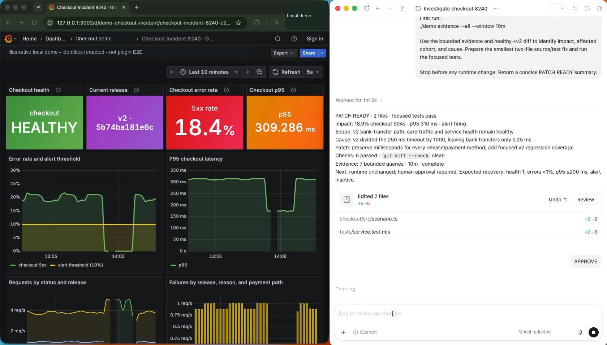

# Community Plugins

Public, installable Codex plugins designed to be understandable and safely
verifiable from the first task.
Each plugin ships with its own manifest, operating guidance, tests, and
reproducible release evidence.

## Grafana Observability for Codex

[](docs/media/grafana-production-monitoring-demo-8x.mp4)

**[Watch the 23-second demo · 8× speed](docs/media/grafana-production-monitoring-demo-8x.mp4)** · [Full walkthrough · 3 minutes](docs/media/grafana-production-monitoring-demo.mp4)

[Grafana Observability](plugins/grafana-observability/README.md) gives Codex five
bounded, administrator-reviewed ways to inspect Grafana evidence for
infrastructure, APM, logs, IoT/edge, and business KPIs. Grafana and its
datasources stay read-only; the plugin writes only its own local audit and
evidence state.

## Install

Requires Codex and Node.js 22.19 or newer:

```sh
codex plugin marketplace add tonyloehr/community-plugins --ref main
codex plugin add grafana-observability@community-plugins
```

Start a new Codex task after installation, then try:

```text
Use $setup-grafana-observability to check the fixture profile and available packs.
```

The default startup is a credential-free fixture, so installation can be
checked without touching a Grafana instance. A real connection requires a
read-only identity and an administrator-reviewed signed authority bundle. See
the [plugin guide](plugins/grafana-observability/README.md) for the guarded
setup flow and platform limits.

The five evidence skills intentionally do not run against a canned Grafana
dataset on first install. They stop until an administrator activates the exact
packs and scopes the customer has reviewed, so simulated results cannot be
mistaken for live evidence.

## What ships

```text
.agents/plugins/marketplace.json      # Codex marketplace catalog
plugins/grafana-observability/         # Installable plugin package
tests/grafana-observability/           # Package, provider, auth, and install tests
vendor/grafana-observability-source/  # Pinned source snapshot and receipts
scripts/                               # Validation and reproducibility tooling
```

The Grafana plugin includes:

- a `.codex-plugin/plugin.json` manifest and `.mcp.json` launcher;
- six cold-start skills, including setup and five focused investigation paths;
- five MCP tools with aliases, bounded windows, and opaque evidence references;
- an integrity-checked packaged runtime, schemas, legal notices, and icon;
- synthetic, real-Grafana, authentication, installed-client, Keychain, and
  source-provenance tests.

The manifest declares both `Read` and `Write` because pack runs persist
plugin-owned local evidence/audit files. It does not grant Codex write access
to Grafana, datasources, dashboards, services, or deployments.

## Verify

No `npm install` is needed for the default package checks:

```sh
npm run validate
npm run verify:grafana:source
npm run test:grafana
```

For the Docker matrix, authentication, installed-client, native Keychain, and
byte-for-byte source rebuild commands, see the
[Grafana test guide](tests/grafana-observability/README.md). Source provenance
and update mechanics are documented in
[Grafana source and reproducible builds](docs/grafana-observability-source.md).

## Contribute

Treat each plugin as a distributable product: keep its manifest, cold-start
instructions, safety boundary, tests, licenses, and notices together. Run the
checks above before opening a pull request, and use the
[review and publish checklist](docs/review-and-publish.md) for release changes.

This repository is Apache-2.0 licensed. Individual plugins can carry their own
license and third-party notices; review those files before redistribution.
