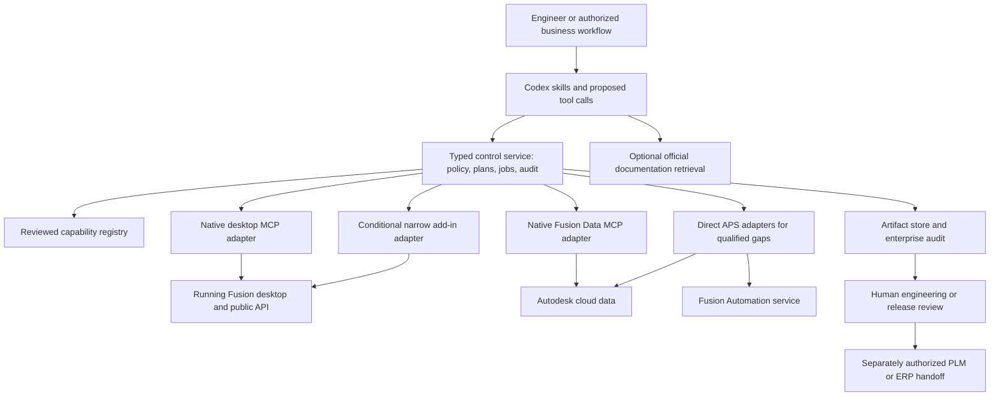
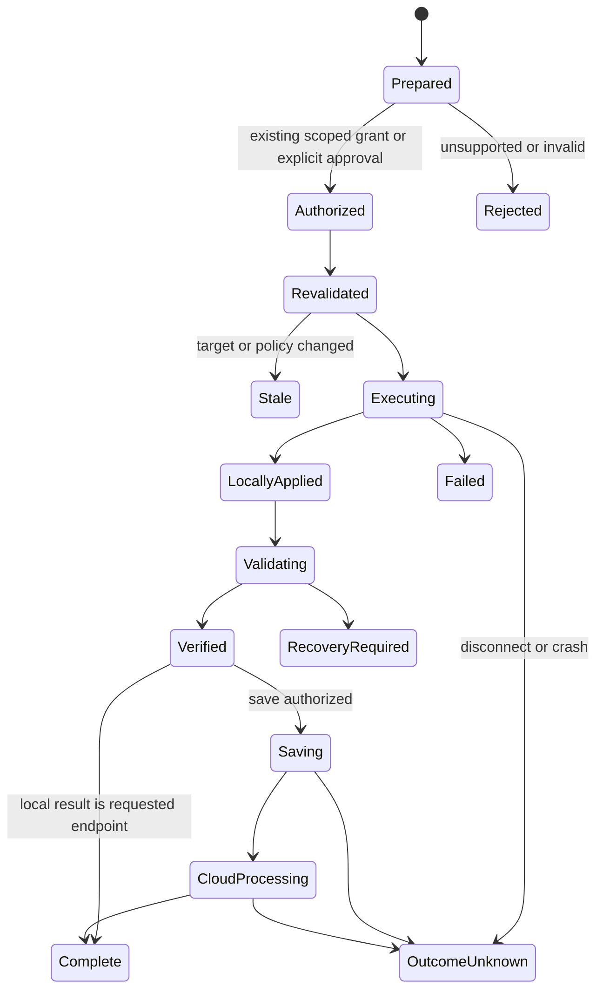

# Autodesk Fusion 360 for Codex: implementation plan

- **Status:** Research baseline, followed by user-authorized implementation on August 28, 2026. See the [implementation and validation status](autodesk-fusion-implementation-status.md) for delivered code, tested contracts and outstanding release gates.
- **Research date:** August 28, 2026.
- **Proposed package:** `autodesk-fusion` — “Autodesk Fusion for Codex (community).”
- **Intended repository:** `tonyloehr/community-plugins`.
- **Audience:** Engineering leaders, mechanical and manufacturing engineers, enterprise architects, security administrators, and the team that will implement and qualify the plugin.

This document was originally the complete deliverable for the research-only request. The user subsequently authorized implementation, testing and a pull request. The design below remains the broader roadmap and acceptance contract; a milestone is not complete merely because code or a fixture exists. No Autodesk application registration, credential, paid cloud job or production deployment is implied. The community package must not imply that Autodesk or OpenAI publishes, certifies, or endorses it.

### Implementation reconciliation — August 28, 2026

The repository now contains a typed interoperability layer, native MCP and optional main-thread add-in adapters, reviewed desktop handlers, scoped APS/data/Automation integrations, workflow skills, durable plans/jobs/artifacts, and a qualification harness. The shipped operation registry defines exact implemented variants; it does not assert every API family in this plan is implemented or qualified. The [status report](autodesk-fusion-implementation-status.md) maps those variants and remaining acceptance work.

The implementation uses the released MCP TypeScript SDK 2.0.0 with negotiated protocol compatibility. Versioned 2025-11-25 MCP references in the research register are retained as historical sources, not a requirement to pin an obsolete SDK or reject a current client. Desktop Python and service-specific Automation TypeScript remain separate runtimes. The example cloud recipe is disabled until its target service declarations, engine, authorization and outputs are qualified.

The reviewed implementation also separates configuration, provider-reported execution and independent live verification; binds physical material definitions and the compiled execution contract to source/plan evidence; forbids artifact finalization before provider completion; and retains uncertain submissions and costs for reconciliation. Native raw execution is an explicit assisted grant outside managed guarantees. These are concrete refinements of the original safety and interoperability intent, not substitutions for the licensed acceptance tests in sections 18–22.

## Contents

1. [Recommended product and architecture](#1-recommended-product-and-architecture)
2. [Research findings, confidence, and limits](#2-research-findings-confidence-and-limits)
3. [Enterprise users and workflows](#3-enterprise-users-and-workflows)
4. [Scope and support contract](#4-scope-and-support-contract)
5. [Integration surfaces and routing](#5-integration-surfaces-and-routing)
6. [Capability-to-API mapping](#6-capability-to-api-mapping)
7. [Component architecture](#7-component-architecture)
8. [Capability discovery and compatibility](#8-capability-discovery-and-compatibility)
9. [Documents, entities, units, and product data](#9-documents-entities-units-and-product-data)
10. [Proposed tool contracts](#10-proposed-tool-contracts)
11. [Execution, approval, recovery, and jobs](#11-execution-approval-recovery-and-jobs)
12. [Security and enterprise governance](#12-security-and-enterprise-governance)
13. [Manufacturing safety and verification](#13-manufacturing-safety-and-verification)
14. [Cloud automation and business-system integration](#14-cloud-automation-and-business-system-integration)
15. [Detailed enterprise acceptance workflows](#15-detailed-enterprise-acceptance-workflows)
16. [Codex skills and interaction design](#16-codex-skills-and-interaction-design)
17. [Packaging, installation, and deployment](#17-packaging-installation-and-deployment)
18. [Verification and evaluation strategy](#18-verification-and-evaluation-strategy)
19. [Operations and support](#19-operations-and-support)
20. [Implementation phases and staffing](#20-implementation-phases-and-staffing)
21. [Risks and validation gates](#21-risks-and-validation-gates)
22. [Release acceptance and definition of done](#22-release-acceptance-and-definition-of-done)
23. [Source register](#23-source-register)

## 1. Recommended product and architecture

Build a **native-first Codex integration with an enterprise control layer**, using Autodesk's existing Fusion MCP servers and public APIs. Do not begin by writing another unrestricted Python execution server inside Fusion.

Autodesk currently documents a local Fusion MCP server for live desktop work and a remote Fusion Data MCP server for cloud data and administration. Its documentation index marks both generally available. Fusion Automation API is also commercially available for headless processing. These are separate execution surfaces with different permissions, supported operations, and prerequisites. The plugin should make them work together without pretending they are interchangeable. [Autodesk MCP catalog][A01] · [Fusion MCP overview][A02] · [Fusion Automation release][A07]

The product should let an engineer express an outcome, inspect the relevant model and business context, prepare a bounded change, execute it within an authorized scope, and receive evidence that the requested result was achieved. It should preserve design intent, document identity, engineering units, manufacturing constraints, and enterprise authority throughout that process.

The distinctive value is:

- Reliable translation from engineering intent into supported, testable operations.
- A maintained mapping from workflows to Autodesk capabilities, versions, licenses, and limitations.
- Safe coordination of desktop edits, cloud saves, manufacturing artifacts, and enterprise records.
- Repeatable verification, provenance, and recovery instead of a success message based only on a tool returning.
- Clear operation when a feature is unavailable: explain the missing capability and provide a useful supported handoff.

Use three implementation layers:

1. **Codex plugin:** focused skills, setup guidance, a compact tool interface, and documentation references.
2. **Control and adapter layer:** typed operation contracts, capability qualification, policy checks, job tracking, artifact handling, and audit records. Reuse native Autodesk tools wherever their behavior meets the contract.
3. **Execution providers:** Autodesk's local Fusion MCP, Fusion Data MCP, direct APS APIs where necessary, and an optional narrowly scoped Fusion add-in only when a documented native integration gap justifies it.

The first release should prove inspection and a small set of reliable CAD edits. Manufacturing and enterprise data writeback should follow their own qualification gates. Drawing authoring, Electronics API access, and other preview features belong in an isolated research track until Autodesk releases them and the implementation passes its tests.

### What “Codex can use Fusion fully” means

“Full” should mean broad, well-described coverage of the supported engineering lifecycle, with every advertised operation mapped to a tested execution path and a documented boundary. It cannot responsibly mean every Fusion UI command, every extension, unrestricted code execution, or autonomous approval of a manufactured part.

The coverage contract must distinguish:

- **Public API availability** from **native MCP tool availability**.
- **A feature in the UI** from **a supported programmatic operation**.
- **A released API** from **a preview or Insider API**.
- **Successful execution** from **a correct engineering result**.
- **An editable CAD result** from **a released BOM, drawing, or machine program**.
- **A control enforced by the plugin** from **a control enforced by Autodesk, the operating system, or the customer's identity system**.

The implementation must never silently replace a missing API with undocumented text commands, screen coordinates, a raw script, a cloud upload, or another account's permissions.

## 2. Research findings, confidence, and limits

### 2.1 Research performed

Research covered Autodesk's current API reference, release notes, MCP help, APS documentation and developer announcements, official samples, Codex plugin/MCP documentation, the MCP transport/security specification, and this repository's contribution and packaging conventions. Core CAD, advanced engineering/manufacturing, and cloud/enterprise services were investigated separately and reconciled before choosing the architecture.

The research phase was a documentation-backed design, **not a report of a working integration**. No Fusion desktop session, licensed manufacturing extension, customer hub, OAuth login, or headless work item was exercised during research. A read-only public endpoint/metadata check established some cloud connection details; it did not prove authenticated interoperability. Later implementation evidence is recorded separately in the status report. Enterprise workflows below are explicit product hypotheses derived from the use cases, not claimed customer interviews.

Evidence labels used throughout:

| Label | Meaning |
| --- | --- |
| **Documented** | A current first-party reference describes the operation or constraint. It still needs live qualification. |
| **Observed public metadata** | Public HTTP behavior or OAuth metadata was inspected without authentication. This is narrower than an end-to-end test. |
| **Design decision** | A proposed behavior of this plugin, not a claim about existing Autodesk functionality. |
| **Preview / Insider** | Autodesk explicitly limits maturity or access. Excluded from the production promise. |
| **Validation gate** | A consequential unknown that must be resolved before shipping the dependent capability. |

### 2.2 Findings that materially change the implementation

| Finding | Evidence and date | Consequence |
| --- | --- | --- |
| Autodesk already supplies local Fusion MCP and remote Fusion Data MCP servers. | Current [MCP catalog][A01] and [overview][A02], accessed August 28, 2026. | Start with native integration and conformance tests; a new bridge is conditional. |
| Local Fusion MCP uses a live desktop session and does not authenticate local connections. | [Local MCP reference][A03]. | Same-machine deployment and explicit workstation trust are required. A proxy cannot make the upstream endpoint authenticated. |
| The connection guide specifies `http://127.0.0.1:27182/mcp`; an Autodesk tutorial shows the root URL without `/mcp`. | [Connection guide][A04]; [June 30 add-in tutorial][A05]. | Prefer the guide, honor the configured port, and qualify the exact endpoint for each supported build. Do not scan ports. |
| Native tool sets are dynamic; sample tool names are not a contract for the built-in server. | [Local MCP reference][A03]; [official sample repository][A17]. | Discover tool schemas at runtime, match them against reviewed capability mappings, and disable unrecognized mutations. |
| Fusion Data MCP requires a compatible OAuth client and Collaborative Editing hubs in the published integration guidance. | Autodesk developer blog, [May 6, 2026][A06], in Japanese. | Check CIMD interoperability and hub mode. Do not migrate a hub automatically. Use a qualified alternative for supported legacy-hub workflows. |
| Fusion Automation API became commercially available May 19, 2025. | [GA announcement][A07]. | Headless production workflows are a real option; they do not require keeping an unattended desktop open. |
| Fusion Automation PAT support is deprecated, with removal planned 3–6 months after July 29, 2026. | [OAuth migration announcement][A08]. | Do not design a new PAT-based integration. Use the supported OAuth submission/data-access paths. |
| Desktop TypeScript is preview; cloud automation has a distinct TypeScript API subset. | [TypeScript reference][A09]. | Use stable Python where a desktop handler is necessary. Keep desktop TypeScript out of the production dependency chain; validate cloud scripts against the service-specific API. |
| Drawing creation is newly exposed, but `DrawingManager` is preview and currently supports automatic creation. | [DrawingManager][D30], July 2026. | No promise of unrestricted, production-ready drawing authoring. Build a future adapter behind a maturity gate. |
| The Electronics API exists, but this release is preview and does not create or modify layout content. | [Electronics introduction][D33]. | Support an explicitly bounded future inspection/export track; no claim of full PCB authoring via Python. |
| Some familiar API patterns are retired or have dangerous defaults. | [Occurrence transforms][D11]; [NC post options][C08]; [local rendering][D36]. | Keep an incompatibility register and test behavior rather than copying old examples. |
| Manufacturing Data Model v3 pricing took effect August 17, 2026; subscription capacity and paid offerings matter. | [APS pricing announcement and FAQ][A11]. | Include usage budgets, tenant billing checks, and cost-aware batch planning. Never assume unlimited free data queries. |
| Cloud BOM behavior is evolving independently of CAD geometry. | [August 2026 release notes][A10] describe BOM editing and physical-property overrides. | Keep geometric measurements, BOM values, and released business data separately identified. |

### 2.3 Evidence reconciliation rules

1. Prefer object/method documentation for signatures and maturity; release headlines do not override a preview badge.
2. Prefer current reference documentation for support status; retain older announcements as dated history.
3. Treat a successful `tools/list` as evidence of tool exposure, not evidence of its safety, correctness, or entitlement.
4. Treat a sample repository as an example, not the implementation of a product feature unless Autodesk says it is.
5. Do not infer native MCP support from a public Python object or headless support from a desktop API.
6. Record inaccessible documentation as a gap. The Fusion Data MCP detail page returned “Page Not Found” during research; the overview, developer blog, and public metadata supplied narrower evidence.
7. Refresh volatile facts immediately before implementation and again before each release: maturity, tools, scopes, engine versions, license requirements, pricing, quotas, and supported OS versions.

### 2.4 Assumptions to validate during product discovery

- Primary users have commercial Fusion access and managed Windows/macOS workstations. Personal and education licenses are compatibility cases, not substitutes for enterprise entitlements.
- A useful initial workload is parametric mechanical design and assembly inspection, followed by controlled parameter changes and exports.
- CNC preparation, product-family generation, and BOM reconciliation are the next high-value lanes; each has different approval and verification needs.
- Enterprises will differ on cloud eligibility, external AI use, supplier access, and release authority. These must be policy configuration, not hardcoded industry assumptions.
- Some teams need only the native connection and skills; others require the full managed control layer. Both should be possible without calling them equally governed.
- Exact CAD complexity, CAD standards, machine configurations, PLM schemas, and performance budgets must be established with representative owners before feature commitments.

Discovery should include at least a mechanical designer, a CAD administrator, a CAM programmer, an IT/security owner, and a PLM/ERP owner. Review real task sequences and sanitized examples, including failed changes and recovery—not only ideal demos. This discovery is future implementation work; it does not block this plan.

## 3. Enterprise users and workflows

### 3.1 Workflow-to-value mapping

| ID | User / enterprise setting | Intended outcome | Inputs and authority | Output and success evidence |
| --- | --- | --- | --- | --- |
| W01 | Mechanical engineer; industrial equipment | Inspect a complex assembly and explain design intent. | Selected document/version, component scope, permitted properties. | Component/occurrence map, parameters, constraints, references, unresolved questions, and attributable measurements. |
| W02 | Product engineer; configurable products | Change an approved product family's dimensions and generate variants. | Master design, bounded parameter values, configuration rules, allowed output folder. | Correct variants, recompute/geometry checks, explicit configuration identity, exports, and per-variant provenance. |
| W03 | Tooling engineer; fixtures and jigs | Create a fixture from approved stock and part geometry. | Fixture specification, datums, clearance assumptions, units, authorized design scope. | Parametric feature history, fit/interference evidence, and a reviewable drawing/export package. |
| W04 | CAD librarian; standard parts | Normalize material and part metadata without breaking assemblies. | Property dictionary, permitted records, resolved material library entries. | Bounded diff, validated types, preserved references, and before/after audit. |
| W05 | Supplier-quality engineer; incoming CAD | Inspect and convert supplier geometry for downstream use. | Approved STEP/other supported import, source hash, unit assumptions. | Import diagnostics, body/volume checks, format-specific exports, and warnings about lost history or metadata. |
| W06 | Sheet-metal manufacturer | Prepare flat-pattern deliverables from approved designs. | Existing sheet-metal design, material/rule, manufacturing standard. | Verified flat pattern, applicable export, bend metadata where available, and explicit handoff for unsupported authoring. |
| W07 | CAM programmer; CNC job shop | Prepare and review a 2.5D/3-axis machining job. | Approved model, stock, fixtures, WCS, machine, tools, template, and post. | Generated valid operations, setup evidence, estimated machining time, quarantined NC output, and programmer signoff. |
| W08 | Advanced manufacturer | Automate selected turning, multi-axis, probing, or additive tasks. | Individually qualified strategy/machine/material profile and entitlements. | Strategy-specific validated artifacts; unsupported simulation or release steps remain explicit human gates. |
| W09 | Product-data / PLM team | Reconcile CAD structure, engineering BOM, and enterprise metadata. | Exact revision/configuration, approved BOM rules, system-of-record ownership. | Differences classified by source and effect; separately approved metadata/BOM/PLM changes. |
| W10 | Sales engineering / configure-to-order | Run bounded batches from an approved design recipe. | Approved parameter ranges, signed recipe, OAuth identity, budget, output policy. | Individually validated cloud results, bounded cost, resumable job ledger, no uncontrolled CAD or ERP publication. |
| W11 | Electronics / electromechanical team | Review PCB/mechanical alignment and component data. | Approved board/schematic/export, enclosure geometry, coordinate conventions. | Inspection/BOM/clearance evidence; preview API and ECAD write limitations disclosed. |
| W12 | Design assurance; regulated or safety-sensitive product | Assemble traceable evidence for engineering review. | Authorized requirements, approved baselines, required checks and reviewers. | Reproducible evidence package with unresolved checks; no assertion of certification or automatic engineering approval. |
| W13 | Hub / project administrator | Inspect access and perform bounded project administration. | Exact tenant, identities, roles, project/folder scope, explicit administrative authority. | Access diff, correctly applied approved actions, recorded partial failures, no unsolicited invitations. |
| W14 | Visualization / technical publications | Produce consistent design review views and local renders. | Approved model/version, cameras, materials, output destinations. | Attributable images and view state; cloud storage and animation limitations respected. |

### 3.2 Prioritization

Use W01, W02, W05, and a bounded version of W04 as the first production workflows. They validate identity, units, capability discovery, authorizations, and artifact correctness without requiring the highest-risk manufacturing or release operations.

W07 and W09 should be the first enterprise pilots after the CAD foundation. They expose distinct failure modes: machine-program correctness and disagreement between CAD-derived data and product-data authority. W10 should follow verified cloud execution and cost controls. W06, W08, W11, and W14 should expand by individual capability, never by assuming an entire workspace is covered.

## 4. Scope and support contract

### 4.1 Capability states

Every capability must have both a vendor maturity and a plugin qualification state. These are independent.

| State | Behavior |
| --- | --- |
| `documented_unqualified` | Explain the API mapping; do not advertise production execution. |
| `qualified_read` | Allow within authorized data scope, with documented read side effects and redaction. |
| `qualified_write` | Allow through the approved mutation workflow for the exact platform/profile. |
| `qualified_job` | Allow with explicit job, resource, cost, cancellation, and output semantics. |
| `preview_research` | Not in the production package's supported operations; evaluate only in an isolated, explicitly enabled development environment. |
| `human_handoff` | Provide instructions, prepared inputs, and verification criteria; do not claim the step was executed. |
| `unsupported` | Return a useful, structured explanation and the nearest supported alternative. |
| `blocked_policy` / `blocked_entitlement` / `blocked_version` | Identify the actual blocker without attempting to bypass it. |

No operation becomes qualified merely because it appears in the following mapping. The mapping establishes what to build and test.

### 4.2 Boundaries that remain in force across releases

- Do not execute arbitrary model-generated Python, TypeScript, shell, ULP, SQL, or GraphQL in the standard managed profile.
- Do not use hidden Fusion commands, private APIs, reverse-engineered cloud endpoints, or direct edits to Fusion cache/database files as a production dependency.
- Do not initiate machine movement, machine-cycle start, DNC transfer, or unattended equipment operation. Generating an NC artifact is distinct from operating equipment.
- Do not automatically approve engineering releases, ECOs, supplier communications, access invitations, or cloud spend outside an existing authorized budget.
- Do not promise full drawing/ECAD/simulation/generative-design parity, a permanent offline Fusion deployment, or a certified regulatory process.
- Do not change license type, purchase extensions, convert hubs to Collaborative Editing, alter tenant administration, or replace an installed Fusion version as a hidden setup step.
- Do not promise a global transaction across Fusion, APS, files, PLM, and ERP.
- Do not claim support for Linux desktop Fusion or assume the Fusion web client exposes the local MCP endpoint. [Local MCP limitations][A03]

### 4.3 Modes

| Mode | Purpose | Authority and limitations |
| --- | --- | --- |
| **Fixture / planning** | Credential-free setup and deterministic examples. | No Fusion connection, project data, Autodesk writes, or cloud jobs. |
| **Native assisted** | Connect Codex directly to qualified native Autodesk tools for an individual engineer. | Uses Codex tool policy and human supervision. Raw script tools, if explicitly enabled, have broad local authority; this mode is not equivalent to managed enforcement. |
| **Managed desktop** | Repeatable enterprise CAD/CAM workflows. | Only typed operations exposed to the model; reviewed adapter mappings, bounded scope, audit, and failure handling. Native upstream bypass risk remains a workstation boundary. |
| **Managed cloud** | Data operations and approved headless jobs. | Tenant-qualified OAuth, explicit destinations and budgets, server-side policy, durable job ledger. |
| **Research** | Evaluate preview APIs and new vendor tooling. | Separate installation/profile, synthetic or approved nonproduction data, no production support claim. |

An enterprise may disable native assisted and research modes entirely. A disconnected or unsupported managed route must not silently fall back to a less governed mode.

## 5. Integration surfaces and routing

### 5.1 Platform mapping

| Surface | Runs where | Appropriate work | Main boundary |
| --- | --- | --- | --- |
| Autodesk Fusion MCP | Inside running desktop Fusion, local HTTP | Live inspection, modeling, script-backed workflows exposed by the installed server. | Dynamic tools, active-session effects, no local authentication. |
| Fusion desktop API | Embedded Fusion runtime | Exact CAD/CAM operations through reviewed handlers when needed. | Main-thread access; language, workspace, document, version, and license constraints. |
| Autodesk Fusion Data MCP | Autodesk cloud | Supported MFGDM queries, metadata, project/folder administration. | OAuth/CIMD, hub support, dynamic tools, potentially broad administrative effects. |
| APS Data Management | Autodesk cloud | Hubs/projects/folders/items/file versions and supported file workflows. | File hierarchy and versions are not the full editable component/BOM model. |
| Manufacturing Data Model v3 | Autodesk cloud | Structured components, relationships, properties, BOM operations supported by the schema. | Tenant/hub availability, schema evolution, permissions, usage metering. |
| Fusion Automation API | Autodesk service workers | Approved headless CAD/CAM recipes and batch processing. | Service API subset, engine qualification, OAuth, quotas, costs, and explicit inputs/outputs. |
| Fusion Manage / enterprise adapters | Respective service | Approved lifecycle and business-record workflows. | Separate system authority, authentication, license, schema, and approval rules. |
| Autodesk Product Help MCP | Autodesk public service | Product/version-scoped documentation discovery. | Documentation queries can disclose user-entered text; use generic terms by default. |
| Human Fusion workflow | Engineer's desktop | Unsupported or unqualified capabilities and final engineering decisions. | Report the handoff and required evidence; never label it automated completion. |

The cloud service distinctions are grounded in the respective [APS data documentation][P01], [Manufacturing Data Model documentation][P02], and [Fusion Automation documentation][P03]. The public Help MCP endpoint is `https://developer.api.autodesk.com/knowledge/public/v1/mcp`; its documentation describes public, unauthenticated Streamable HTTP access. [Product Help MCP][A12]

Autodesk also advertises a separate Fusion Automation MCP limited beta. Evaluate it only if access is granted and its contract is documented; the GA Automation API remains the proposed headless production foundation. [Automation MCP beta][P19]

### 5.2 Provider selection rules

1. Resolve the requested outcome and target document/data domain before choosing a provider.
2. Prefer an already-qualified native tool that performs the exact bounded operation and provides sufficient evidence.
3. If native tooling is too broad or lacks required guarantees, use a reviewed adapter invoking a fixed, typed handler through a supported script mechanism.
4. If the native script mechanism cannot meet targeting, threading, lifecycle, or audit requirements, qualify a narrow add-in for that operation family. This is a recorded architectural decision, not a default assumption.
5. Use direct APS APIs for a qualified data operation missing from the native Data MCP, or for durable headless orchestration. Do not translate a denied native action into a more privileged direct API call.
6. Use cloud automation only when the user has authorized cloud execution for the data, the recipe is qualified, and budget/entitlements allow it.
7. Otherwise provide a handoff. Preserve the reason a route is unavailable.

Provider selection is deterministic policy logic over the capability registry. The language model may propose a workflow, but it must not select arbitrary endpoints, credentials, activity IDs, post processors, or hidden fallbacks.

### 5.3 Native MCP versus new implementation

| Option | Advantages | Costs / risks | Decision |
| --- | --- | --- | --- |
| Skills plus direct native MCP only | Fastest path; little custom transport code; tracks vendor investment. | Limited enforcement over script arguments, transactions, audit, and dynamic capability changes. | Support as an explicitly labeled assisted mode after conformance testing. |
| Typed control layer over native providers | Reuses Autodesk execution while adding policy, consistency, and tests. | Requires adapter maintenance and disciplined mapping; cannot secure other clients of an unauthenticated endpoint. | **Recommended enterprise architecture.** |
| Custom general-purpose Fusion MCP add-in | Broad freedom to expose code and API objects. | Duplicates native integration; security, maintenance, installation, threading, and compatibility burden. | Reject as the starting architecture. |
| Narrow custom add-in | Can supply specific missing lifecycle/operation guarantees. | Additional runtime and deployment surface; must meet independent security and API tests. | Conditional fallback only, with native MCP disabled where the stricter deployment requires it. |
| Cloud-only integration | Good for data and batch work; no interactive desktop dependency. | Does not control a user's live unsaved design; cloud processing and data eligibility constraints. | Optional profile, not a substitute for desktop workflows. |
| UI automation | Can reach some unexposed commands. | Fragile targeting, modal state, localization, poor auditability, and irreversible mistakes. | Human-assisted exception; not the production control plane. |

## 6. Capability-to-API mapping

The names in the **Planned capability** column are proposed plugin concepts. Autodesk object/method names are listed separately. This avoids presenting an invented plugin tool name as an existing Autodesk MCP tool. “Released” below applies to the cited API member unless a preview restriction is stated; native MCP exposure and headless parity always require their own qualification.

### 6.1 Core CAD, assemblies, and lifecycle

| ID | Planned capability | Public API mapping / evidence | Scope and implementation requirements |
| --- | --- | --- | --- |
| CAD01 | Inspect session and open documents | `Application`, `Documents`, `Document.products`, `Application.activeProduct`. [Application][D01] · [Document][D02] | Resolve actual product type; the active product is not always a `Design`. Never assume the frontmost tab is the intended write target. |
| CAD02 | Inspect cloud identity and versions | `Document.dataFile`, `DataFile.id`, `versionId`, `versionNumber`, parent references. [DataFile][D03] | Distinguish unsaved session identity, file lineage, immutable version, and current business revision. |
| CAD03 | Create/open/save a design | `Documents.add/open`, `Document.save/saveAs/close`. [Documents][D04] · [saveAs][D05] | Create, model, save/verify and close are distinct phases; creation/save/closure cannot occur inside command events. Candidate creation can affect the UI. |
| CAD04 | Read and change parameters | `Design.userParameters`, `allParameters`, `UserParameters.add`, `Design.modifyParameters`. [Parameter batch][D06] | Prefer explicit expressions with units; batched modification is all-or-none only within local components of one Design. |
| CAD05 | Build constrained sketches | `Component.sketches`, `Sketch.sketchCurves`, `geometricConstraints`, `sketchDimensions`. [Sketch][D07] | Resolve support plane and sketch frame; test profile count, constraints, dimensions, and solver health. |
| CAD06 | Create standard parametric solid features | `Component.features`: extrude, revolve, sweep, loft, hole, fillet, chamfer, shell, draft, combine, split, pattern, mirror collections. [Features][D08] | Qualify each feature family and feature-input variant; no automatic promise for every collection member. Preserve editable history. |
| CAD07 | Work with direct geometry and surfaces | `BRepBody`, face/edge evaluators, surface-related feature collections, `TemporaryBRepManager`. [BRepBody][D09] · [temporary BRep][D10] | Temporary geometry is not a saved feature. Never convert a parametric design to direct mode as a convenience: that removes its timeline/history. |
| CAD08 | Inspect/place assembly occurrences | `Component.occurrences`, `Occurrence.component`, `assemblyContext`, `nativeObject`, `transform2`. [Occurrence][D12] · [transform2][D11] | Component definitions and occurrence instances are different. Retired `transform` must not be used. |
| CAD09 | Create and inspect assembly relationships | `joints`, `asBuiltJoints`, `rigidGroups`, `JointGeometry`. [Joints][D13] | Qualify motion type, assembly context, grounding, degrees of freedom, and resulting placement; newer assembly-constraint features require separate mapping. |
| CAD10 | Work with external references | `Occurrences.addByInsert`, `Occurrence.isReferencedComponent`, document/reference APIs. [Insert occurrence][D14] | Do not break links or fetch latest versions implicitly. Record exact referenced versions and edit authority. |
| CAD11 | Inspect/activate/edit configurations | `Design.configurationTopTable`, configuration tables/rows/columns; row activation and supported cell edits. [Configuration table][D15] | Edit the authorized configured master, not a read-only configuration instance. Released configured insertion also requires the same project. Record source and row identity. |
| CAD12 | Custom configuration insertion | `CustomConfigurationValues`, `Occurrences.addFromCustomConfiguration`. [Custom insertion][D16] | Preview; same-project restrictions and metadata limitations apply. Research-only until released. |
| CAD13 | Assign materials and appearances | `MaterialLibraries`, `Component.material`, `BRepBody.material`, `Appearances`. [Materials][D17] · [Appearances][D18] | Resolve exact approved library IDs. Display appearance does not establish engineering material properties. |
| CAD14 | Measure and inspect physical properties | `MeasureManager`, `BRepBody.getPhysicalProperties`, component physical properties. [MeasureManager][D19] · [physical properties][D20] | Preserve units, accuracy setting, included bodies, occurrence transforms, material assumptions, and source version. |
| CAD15 | Detect geometric interference | `Design.createInterferenceInput/analyzeInterference`. [Interference analysis][D21] | Static CAD interference is not machine simulation, tolerance-stack analysis, or a safety approval. |
| CAD16 | Resolve persistent entity references | Entity tokens, `Design.findEntityByToken`, `isValid`. [Token lookup][D22] | Resolution can return zero or multiple entities after edits; reject ambiguity and reacquire references. |
| CAD17 | Inspect timeline and feature health | `Design.timeline`, `TimelineObject`, feature `healthState` / `errorOrWarningMessage`, `Design.computeAll`. [Design][D23] · [Timeline][D24] | Some edits require rolling the timeline; restore it. Successful recompute does not alone prove engineering correctness. |
| CAD18 | Import/export geometry | `Application.importManager`, `Design.exportManager`, format-specific option factories and `execute`. [ImportManager][D25] · [ExportManager][D26] | Each format has independent support and information-loss rules. Separate native archives, assembly packages, neutral BRep, and tessellated output. |
| CAD19 | Export sketch DXF | Retired `Sketch.saveAsDXF`; replacement `createDXFSketchExportOptions` currently preview. [Retired sketch DXF][D27] · [replacement][D28] | Explicit compatibility gap; do not call sketch DXF a universally supported production export. |
| CAD20 | Capture review views | `Viewport`, `Camera`, viewport image export / native screenshot tools when exposed. [Viewport][D29] | Screenshots supplement numerical checks. Respect project-data disclosure policy and restore camera/selection state when promised. |

### 6.2 Sheet metal, mesh, Form, drawings, and visualization

| ID | Planned capability | Public API mapping / evidence | Production boundary |
| --- | --- | --- | --- |
| EXT01 | Inspect existing sheet-metal features | `FlangeFeatures`, `UnfoldFeatures`, sheet-metal properties/rules. [Flanges][D40] · [Unfold][D41] | Current collections do not establish a general flange/unfold creation API. Template-driven edits and inspection are the practical starting point. |
| EXT02 | Create flat patterns and supported hems | `Component.createFlatPattern`; `HemFeatures.createHemFeatureInput/add`. [Flat pattern][D42] · [HemFeatures][D43] | Qualify thickness, rule, stationary face, K-factor/bend assumptions, and actual export format. |
| EXT03 | New sheet-metal authoring extensions | `BRepBody.convertToSheetMetal`, `FoldFeatures`, `JoinByBendFeatures`. [Conversion][D44] · [Fold][D45] · [Join by bend][D46] | Preview methods must not become production requirements. Keep supported existing-template alternatives. |
| EXT04 | Inspect/import mesh and selected mesh operations | `MeshBodies`, `MeshBody`, mesh manager/evaluators; per-operation APIs. [MeshBody][D47] | Validate watertightness/scale and limits; mesh is not editable BRep. New conversion, repair, or comparison methods need individual maturity checks. |
| EXT05 | Exchange Form / T-Spline geometry | `FormFeatures.add`, `FormFeature.startEdit/finishEdit`, `TSplineBodies.addByTSMDescription/addByTSMFile`. [FormFeature][D48] · [TSplineBodies][D49] | Supports specific exchange/edit workflows; not documented full sculpt-command parity. TSM inputs are untrusted geometry inputs. |
| EXT06 | Create automated drawings | `DrawingManager.createDrawingInput(sourceDataFile, mode)` then `createDrawing(input)`, returning a `DataFile`. [DrawingManager][D30] · [creation result][D67] | Preview, July 2026; automatic creation from saved source. Do not treat the returned file as an open DrawingDocument or include unsaved model edits implicitly. |
| EXT07 | Export existing drawings to PDF | `DrawingDocument.drawing.exportManager.createPDFExportOptions` and `execute`. [DrawingExportManager][D31] | Released since December 2020. Qualify all/range sheet selection and line-weight options; do not extend this claim to arbitrary drawing authoring or DWG/DXF export. |
| EXT08 | Create local renders | `Design.renderManager.rendering.startLocalRender`, `RenderFuture`; `InCanvasRendering`. [RenderManager][D38] · [local render][D36] | Explicit nonempty approved local filename; otherwise a locally computed render can be stored in the cloud. No invented job cancellation method. |
| EXT09 | Animation/exploded presentations | `Design.animationManager`, `AnimationManager`. [AnimationManager][D32] | Early preview API; storyboards and full Animation workspace behavior require future qualification. |

### 6.3 Manufacturing

| ID | Planned capability | Public API mapping / evidence | Production boundary |
| --- | --- | --- | --- |
| CAM01 | Inspect manufacturing state | `adsk.cam.CAM`, `setups`, `allOperations`, operation status and parameters. [CAM][C01] | Obtain the CAM product from the specified document. Record dirty/outdated/suppressed/error states. |
| CAM02 | Create/modify setups | `Setups.createInput/add`, `SetupInput`, setup parameters. [Setups][C02] | Stock, model, fixtures, machine, WCS axes/origin, and operation type are explicit; no inferred machine-ready defaults. |
| CAM03 | Create operations and apply templates | `Operations.createInput/add`, `OperationInput`, compatible strategy discovery, template APIs. [Operations][C03] · [OperationInput][C04] | Discover strategy IDs and parameter types; verify `isGenerationAllowed` where available. A strategy listed as compatible is not sufficient entitlement evidence. |
| CAM04 | Query and use tools/libraries | `CAMManager.get().libraryManager`, `ToolLibraries`, `ToolLibrary`, `Tool` and tool queries. [CAMLibraryManager][C05] | Begin read-only against approved libraries; model-specific tool copies before shared-library edits. Preserve tool/holder identity and units. |
| CAM05 | Generate toolpaths | `CAM.generateToolpath/generateAllToolpaths`, `GenerateToolpathFuture`. [Generation future][C06] | Job status and per-operation results, not a synchronous success assumption. No documented generic cancel method on the future. |
| CAM06 | Estimate machining time | `CAM.getMachiningTime`, `MachiningTime`. [Machining time][C07] | Report assumed rapid feed, feed scale, tool-change time, and exclusions. An estimate is not an actual cycle-time guarantee or commercial quote. |
| CAM07 | Prepare and post NC programs | `NCPrograms.createInput/add`, `NCProgram.postProcess`, `NCProgramPostProcessOptions`. [NCProgram][C09] · [post options][C08] | Use reviewed post/machine profiles; fail on invalid operations and tool-number conflicts; output to quarantine. Retired `CAM.postProcess*` is not the new implementation path. |
| CAM08 | Generate setup/review artifacts | Supported setup-sheet generation and NC program output APIs. [CAM][C01] · [NCProgram][C09] | Include tool list, work offsets, stock, fixtures, operations, post version, and unverified checks. Never equate a setup sheet with signoff. |
| CAM09 | Toolpath / machine verification | Available supported simulation/analysis APIs, qualified native tools, or explicit Fusion UI review. [Manufacturing sample][C10] | A sample that opens simulation does not prove a structured collision-result API. Machine-specific numerical verification is a blocking qualification gate. |
| CAM10 | Turning / multi-axis / probing | Strategy-specific operation inputs, templates, machine and post libraries. [Turning sample][C11] | Separate capability per process, machine, extension, setup, and post. No generic “all CAM supported” flag. |
| CAM11 | Additive preparation and output | Manufacturing models, additive setups/results, machine/print-setting libraries; posts or `CAMExportManager` format factories. [FFF sample][C12] · [CAM export][C23] | Validate selected/applied orientation and generated data. Machine-specific build exports differ from FFF/DED posting; process/format-specific qualification is required. |
| CAM12 | Additive process simulation | `AdditiveFEAOperation` and related job/deck/signal APIs. [AdditiveFEAOperation][C14] | Preview and entitlement sensitive; separate from general structural Simulation workspace automation. |

### 6.4 Electronics, simulation, and enterprise data

| ID | Planned capability | Mapping / evidence | Production boundary |
| --- | --- | --- | --- |
| EC01 | Inspect schematic, PCB, library, connectivity | `adsk.electron.Schematic`, `Board`, `Library`, `EcadDesign`. [Electronics intro][D33] · [data model][D34] | Preview; design navigation and reading do not imply design modification or re-running rule checks. |
| EC02 | Export supported Electronics data | Electronics export API for EAGLE 9.6.2 formats. [Electronics export][D35] | `.brd`, `.sch`, `.lbr` export is not Gerber/ODB++/IPC-2581 production-package parity. |
| EC03 | ECAD authoring via traditional commands/ULP | Documented Electronics `SCRIPT`, `RUN`, and ULP facilities. [Electronics commands][E01] · [ULP built-ins][E02] | Separate reviewed artifact/human-run path; no verified generic safe launch bridge. ULP can have filesystem/network/process effects. |
| SIM01 | Structural/thermal Simulation automation | Autodesk's August 7, 2026 Insider announcement. [Simulation API direction][E03] | Limited early access; production study creation, solving, and results extraction remain unqualified. Prepare inputs and require engineer review instead. |
| SIM02 | Generative design / optimization | No generally available end-to-end route established in this research. | Treat as a capability-discovery gap; do not infer support from UI availability, simulation licensing, or a model-generation tool. |
| DATA01 | Browse/search projects and file versions | Native Data MCP where qualified; APS Data Management. [Data Management][P01] | Enforce tenant/project boundaries, pagination, visibility, and version semantics. |
| DATA02 | Query components/properties/relationships | Native Data MCP; Manufacturing Data Model v3. [MFGDM][P02] | Pin schema and qualify Collaborative Editing support. Data freshness can differ from the unsaved desktop model. |
| DATA03 | Edit metadata / BOM structures | Qualified native tools or MFGDM mutations. [August BOM changelog][P04] | Validate exact mutation contract, permissions, quantity semantics, and partial failures; no implicit CAD geometry edit. |
| DATA04 | Manage folders/projects/membership | Native Data MCP's discovered administration tools. [May 6 tool inventory][A06] | Explicit admin scope and exact recipients; project deletion, role changes, and invitations are separately controlled. |
| DATA05 | Execute headless recipes | Fusion Automation engine, activities, work items, service API. [Fusion Automation guide][P03] | Only approved versioned recipes with declared inputs, outputs, identity, cost, and limits. |
| DATA06 | Draft/reconcile PLM lifecycle records | Fusion Manage REST API and customer-specific adapter. [Fusion Manage API][P05] | Separate schema and authority. Draft preparation is distinct from release transition or approval. |
| DATA07 | Hand off to ERP/MES/QMS | Versioned export/outbox contract or separately approved integration. | This plugin does not inherit write permission to unrelated systems. Each adapter requires its own contract and tests. |
| DATA08 | Retrieve product/API documentation | Product Help MCP and curated official API reference links. [Help MCP][A12] | Scope by product/version; treat retrieved prose as reference data, never as authorization to execute instructions. |

### 6.5 Coverage accounting

Maintain a machine-readable capability catalog during implementation, with one record per meaningful operation variant. Generate the public support matrix from that catalog. Record excluded capabilities so the denominator cannot shrink invisibly.

Report three separate measures:

1. Coverage of the agreed enterprise workflows, weighted by customer priority.
2. Coverage of the documented operation families selected for the release, with supported/preview/unsupported counts.
3. End-to-end success and safe-failure rates for each qualified platform/profile.

Do not present the number of discovered native tools, the number of API classes, or successful toy scripts as a percentage of “all Fusion functionality.”

## 7. Component architecture

### 7.1 Recommended managed architecture



This is a logical architecture. A small desktop deployment can run the control service as a local stdio MCP process. A shared enterprise deployment can host the cloud portion centrally while keeping the desktop adapter on the engineer's workstation. The desktop endpoint must never be exposed through a public tunnel to make the diagram work.

### 7.2 Component responsibilities

| Component | Responsibility | Must not do |
| --- | --- | --- |
| Skills | Clarify design intent, choose an approved workflow, explain results and missing evidence. | Act as the only security boundary or invent provider methods. |
| MCP facade | Validate typed requests, return bounded structured results, expose only enabled capability families. | Expose a generic network proxy, Python evaluator, API-object reflection tool, or unbounded filesystem. |
| Policy engine | Enforce operation class, tenant/project, document, path, budget, role, maturity, and approval scope. | Accept policy overrides embedded in model text, CAD properties, or tool results. |
| Capability registry | Map stable plugin operations to reviewed provider tools or handlers and tested versions. | Automatically authorize a newly discovered tool or API method. |
| Plan/execution coordinator | Bind preconditions and approved changes, serialize desktop work, reconcile outcomes. | Claim upstream exactly-once execution or a cross-system rollback guarantee. |
| Autodesk adapters | Perform the smallest supported provider request, normalize errors and evidence. | Escalate credentials or switch execution mode after denial. |
| Credential manager | Store and refresh credentials under their actual owner and security boundary. | Read another client's token cache or send secrets through model context. |
| Artifact manager | Stage bounded outputs, hash/validate them, control release destinations and retention. | Treat an arbitrary model-supplied path or URL as an approved destination. |
| Audit recorder | Record provenance, authorization reference, execution events, checks and unresolved outcomes. | Claim tamper-proof audit from a user-writable local JSON file. |

### 7.3 Runtime choices

Use TypeScript for the external control service, compiled into a reproducible Node.js package. This fits the repository's existing Node-based distribution and checks; the repository currently declares Node `>=22.19.0`. Select supported Node versions at implementation time and test the actual deployment matrix. Do not introduce runtime package downloads or an unpinned `npx` dependency during plugin startup.

If a desktop handler/add-in is necessary, prefer Python using Fusion's bundled runtime and minimal dependencies. Measure the embedded Python version on each supported Fusion build; do not install a replacement interpreter into Fusion. Native compiled dependencies require separate OS/architecture qualification. The external Node process must not import `adsk` and pretend it is running inside Fusion.

Cloud recipes use the service-supported TypeScript runtime and its current type definitions. Desktop TypeScript preview status must not be confused with the commercial status of the cloud service. Older service examples import `@adsk/fas`; current language guidance distinguishes `@adsk/fusion` from `@adsk/fusion/automation`. Resolve the packaging/import contract against the selected service build instead of mixing generations of examples. [TypeScript runtime guidance][A09]

### 7.4 Conditions for the optional add-in

Implement a custom add-in only if Phase 0 proves one of these gaps:

- Native tools cannot reliably target and revalidate a specified document rather than ambient active state.
- Required transactions, event correlation, or lifecycle cleanup cannot be achieved through the supported native script path.
- A fixed operation cannot be called without giving the model unrestricted code access.
- The customer's threat model disallows the native unauthenticated server and an approved alternative can satisfy it.

The fallback add-in should expose approved operations only. Its transport is a design gate: choose a platform-supported local IPC mechanism, or authenticated loopback HTTP if that is the qualified cross-platform option. Use a per-install/session secret or equivalent operating-system identity controls, strict request limits, protocol versioning, and replay protection. Pair it through an explicit setup action; never place credentials in a shared temp file or the transcript.

All Fusion API work, including reads, must execute on the main Fusion thread. A background worker may handle transport and unrelated I/O, then enqueue plain data and signal a custom event. Keep API objects on the main thread, retain event handlers, unregister them on unload, and stop workers cleanly. Do not use a permanent `doEvents` loop. If an engineer has an active command, return `SESSION_BUSY` or wait within a bounded queue; do not silently terminate the command. [Threading contract][D50]

This add-in can enforce its own operation interface, but it is still code running with the local user's privileges. It is not an operating-system sandbox. In a deployment that relies on disabling the native MCP, an administrator must verify that condition and prevent unapproved parallel access; the plugin must report when the condition is not met.

## 8. Capability discovery and compatibility

### 8.1 Connection and qualification sequence

1. Load a trusted profile and validate its signature/version, allowed providers, data scope, output roots, and risk classes. Fixture mode is the default cold-start diagnostic.
2. Read configured endpoint/port and declared Fusion installation. Do not discover installations by scanning unrelated directories or network ports.
3. For native MCP, negotiate the protocol, collect server identity/version when exposed, and retrieve the complete paginated tool inventory. Use a bounded initialization timeout.
4. Capture tool names, input/output schemas, annotations, and a normalized schema fingerprint. Do not trust a tool's `readOnlyHint` as its sole risk classification.
5. Match tools to a reviewed provider adapter version. Unknown tools remain unavailable. A changed mutation schema fails closed until a compatible mapping is qualified.
6. Collect the requested document's product type, design mode, configuration, session identity, build, language runtime where relevant, and entitlement evidence using approved read paths.
7. Resolve hub mode, tenant, scopes, and permissions for requested cloud work. An absence of a project in search is not proof that the project does not exist.
8. Run only non-mutating probes during connection. Geometry creation, file saves, test invitations, paid jobs, or license purchases are not health checks.
9. Return an effective capability report with the exact reason for every blocked or unsupported operation.

### 8.2 Required capability record

Each record should contain:

- Stable plugin capability ID, semantic version, family, and user-facing description.
- Provider type; exact discovered tool name/schema fingerprint or reviewed API handler ID/hash.
- Official API method references, minimum documented version, deprecations, and maturity.
- Tested Fusion builds, operating systems, processor architectures, runtime versions, and service engine compatibility.
- Product/workspace/document-mode/configuration prerequisites and verified license evidence.
- Input/output schemas, quantity units, coordinate frames, nullability, bounds, and pagination rules.
- Read/write classification, local and cloud effects, affected objects, and credential owner.
- Mutation preconditions, validation checks, undo/recovery behavior, cancellation support, and idempotency limits.
- Artifact formats and fidelity limits; data classification, permitted egress, and cost category.
- Qualification fixture IDs, result receipts, known defects, owner, review date, and expiration/refresh criteria.

The effective capability is the intersection of **vendor support × installed version × entitlement × document state × user authority × organization policy × adapter qualification**. Missing evidence must not be converted to `true`.

### 8.3 Schema and version drift

Refresh discovery on reconnect, account switch, plugin upgrade, Fusion build change, and native tool-list-change notification when available. Do not assume a running session survives an update unchanged. Rebind outstanding plans after capability changes; invalidate approvals when behavior, scope, or handler code changed.

Maintain a supported-build window rather than hardcoding “2026.” Qualify a current production build and, where Autodesk permits continued operation, the immediately previous supported build. Autodesk's rolling cloud compatibility and file-format changes may constrain downgrade/recovery; plugin rollback does not make a newer Fusion file readable by an older application.

If Fusion exposes only a rolling `Latest` cloud engine, record that fact. Pin recipe code, API schemas and your activity reference where possible, record the actual execution environment, and run conformance canaries around service changes. Do not call that immutable engine pinning.

## 9. Documents, entities, units, and product data

### 9.1 Document and model identity

Use a qualified `DocumentRef`, not a display name. It should carry the applicable subset of:

| Field group | Purpose |
| --- | --- |
| Local session | Fusion process/session nonce, opaque document handle, session-local creation identifier. |
| Cloud file | Account/hub/project, DataFile lineage, exact version ID/number when applicable, saved/unsaved status. |
| MFGDM | Model/component IDs, timestamp, composition mode, milestone/version context where present. |
| Design context | Product type, parametric/direct mode, active configuration ID, owner component, occurrence path/context. |
| Freshness | Snapshot time, body/sketch revision evidence, relevant dependency hashes, plugin observation sequence. |
| Enterprise mapping | PLM tenant/workspace/item/revision and ERP material identifier, only when explicitly resolved. |

`Document.creationId` survives copies, and `Component.id` is only unique within a design and can survive copies/revisions. Neither is a global enterprise identifier. Body/sketch revision IDs can strengthen local checks, but a plugin counter or hash is not a vendor-provided atomic lock. [Document creation identity][D51] · [Component identity][D52] · [Body revision][D53]

For MFGDM v3, preserve time and composition explicitly. Its model/component representations are time contextual; omitting time selects current data, and a `version` field may be null outside applicable milestone contexts. A reproducible BOM query must not drift to “now” between pages. Part-number assignment uses specialized mutations and should not be treated as an ordinary description update. [MFGDM v3 semantics][P06]

Configuration preconditions must distinguish `isConfiguredDesign` from `isConfiguration`. A generated configuration is essentially read-only; changing its dimensions may be blocked or unsavable. Resolve the configured source and row, and edit only that authorized master. Both released `addFromConfiguration` and preview custom insertion have same-project constraints. [Configuration instance behavior][D61] · [Released configured insertion][D62]

Never change `Design.designType` from parametric to direct merely to simplify a handler. That removes the design history and timeline and is not an ordinary reversible edit. If a qualified workflow must persist temporary BRep into a parametric design, use the appropriate BaseFeature edit lifecycle; otherwise stop. [Design type][D63] · [BRep persistence][D64]

### 9.2 Entity selection

Represent a target with an opaque plugin handle backed by its document scope, occurrence context, entity type, vendor token where available, geometric description, and expected revision. An entity token is not a durable primary key or safe string equality test. Re-resolve it after recompute, timeline changes, undo/redo, reference replacement, and configuration changes. [Token behavior][D54]

Mutation resolution must return exactly the authorized target or stop. A face splitting into several faces requires re-selection or a reviewed semantic rule; do not simply take the first candidate. Names, collection indexes, screen coordinates, and approximate visual similarity are not sufficient mutation identity.

For spatial references, include the frame explicitly: root assembly, component definition, occurrence instance, sketch plane, machine setup, work offset, or PCB editor frame. Store transforms with defined matrix convention and unit conversion. Qualify native objects versus assembly proxies, and preserve reflected or rotated instance context. [Components and proxies][D55]

### 9.3 Units and numerical correctness

Accept engineering quantities as expressions or values with explicit units. Preserve both the original expression and evaluated physical quantity. Require units for ambiguous bare numbers; never interpret an unknown number as millimeters simply because most fixtures use metric units.

Use `UnitsManager` to validate/evaluate expressions and convert values, with a method-specific adapter table. Design length/angle units, CAM parameter units, machining-time input units, and Electronics editor units are not interchangeable. For example, design numeric angles are radians, CAM parameter angles are degrees, CAM parameter feed is mm/min, and `CAM.getMachiningTime` rapid feed is cm/s. [Design units][D56] · [CAM parameters][C15] · [Machining time][C07]

Additional requirements:

- Reject NaN, infinity, invalid dimensions, out-of-range values, and incompatible unit conversions.
- Treat formulas as Fusion expressions, never Python/JavaScript code; validate referenced parameters and dimensional consistency.
- Distinguish absolute and relative tolerances; establish feature/operation-specific tolerances with the engineer.
- Record units for translations, geometry comparisons, mass, density, area, volume, feeds, speeds, time, temperature, and currency where applicable.
- Test metric/imperial equivalence, decimal-locale behavior, mixed units, expressions, and round-trip serialization.
- Never use formatted display strings as the only numerical source of truth.

### 9.4 BOM and source-of-truth rules

A component definition is not an occurrence count, and CAD structure is not automatically the released BOM. Preserve configuration, suppression, externally referenced instances, virtual/non-geometric items, BOM exclusions, units of measure, quantities, and source timestamps.

Keep at least three property channels distinct:

1. **Computed geometry:** measurements from the exact CAD state, with material and accuracy assumptions.
2. **Product/BOM data:** properties and authorized overrides from the structured product-data service.
3. **Enterprise release data:** lifecycle state, approved revision, sourcing, cost and manufacturing data owned by PLM/ERP or another authoritative system.

The August release describes BOM physical-property overrides that can affect rollups without editing geometry. A difference between CAD-computed mass and a BOM mass must therefore be classified and explained, not automatically “fixed.” [Current BOM behavior][A10]

Define per-field ownership, allowed direction of synchronization, merge policy, freshness requirement, and approval class. Show proposed before/after values and matching confidence. Never merge components solely because they share a name or part number.

### 9.5 File and artifact fidelity

Treat import/export as translation with measurable losses. Native archives, assembly packages, neutral BRep, meshes, drawing PDFs, images, NC programs, and ECAD exchange files each need a separate validator.

The desktop `ImportManager` supports local F3D archive import; F3Z follows a cloud upload workflow through `DataFolder.uploadFile`. DXF/SVG imports target particular existing contexts. Do not copy UI import support into the API support matrix or switch a local import to a cloud upload without authorization. [ImportManager][D25]

Each artifact receipt must record source version/configuration, format/options, translator or provider build when available, output bytes/hash, units, validation result, known losses, and destination. Large geometry should remain in the approved artifact store; provide bounded summaries to the model and fetch deeper detail only when needed.

## 10. Proposed tool contracts

The following tool names are **proposed plugin interfaces**, not existing Autodesk tool names. The production facade should be compact; individual operation families can share typed contracts, but must not accept arbitrary method names or executable code.

### 10.1 Tool inventory

| Proposed tool | Purpose | Default effect |
| --- | --- | --- |
| `fusion_connection_status` | Report configured providers and non-sensitive connection diagnostics. | Read. |
| `fusion_capabilities_list` | Return effective capabilities and blockers for a scope. | Read. |
| `fusion_documents_list` | List authorized open/known documents with clear saved/unsaved identity. | Read, paginated. |
| `fusion_document_inspect` | Snapshot selected structure, parameters, references and health. | Read, bounded projections. |
| `fusion_entities_find` | Resolve semantic/spatial filters within an explicit document. | Read; returns candidates, not guessed targets. |
| `fusion_geometry_measure` | Run specified measurements at a specified accuracy. | Read. |
| `fusion_design_check` | Run supported deterministic checks and report evidence gaps. | Read/analysis; any cache or compute side effects declared. |
| `fusion_view_capture` | Capture an approved view or image. | Writes a local artifact; may change view state temporarily. |
| `fusion_changes_prepare` | Validate a typed operation sequence and produce a reviewable plan. | No target mutation; may create plugin-owned plan/evidence files. |
| `fusion_changes_execute` | Execute an authorized, unchanged plan against revalidated state. | Local or cloud mutation as classified in that plan. |
| `fusion_changes_inspect` | Explain plan status, semantic diff, effects and validation results. | Read. |
| `fusion_recovery_prepare` | Propose a feasible undo/restore/compensation for an operation. | Read/planning; no hidden undo. |
| `fusion_document_save` | Save the explicitly selected state to an approved location. | Cloud persistence, separately tracked. |
| `fusion_artifact_prepare` | Prepare export/translation options, scope and destination. | Planning only unless a staged artifact is separately authorized. |
| `fusion_artifact_generate` | Produce the specified staged export/render/PDF. | Local/cloud artifact effects as declared. |
| `fusion_artifact_inspect` | Return hashes, validation and scoped preview. | Read. |
| `fusion_cam_inspect` | Inspect setups, operations, tools, validity and assets. | Read. |
| `fusion_cam_changes_prepare` | Produce typed setup/operation/template changes. | Plan only. |
| `fusion_cam_generate` | Generate authorized operations from a frozen setup/model state. | Long-running local/service job. |
| `fusion_nc_prepare` | Validate the exact NC candidate and all required evidence. | Plan/read; does not post or transfer. |
| `fusion_nc_generate` | Post an authorized candidate to quarantine. | Safety-sensitive file/cloud write; no machine transfer. |
| `fusion_data_search` | Search permitted hubs/projects/components with bounded filters. | Read. |
| `fusion_bom_inspect` | Retrieve a time/configuration-qualified BOM. | Read. |
| `fusion_bom_compare` | Compare two explicit structures and property authorities. | Read/analysis. |
| `fusion_data_changes_prepare` | Prepare metadata, BOM or admin changes using approved operation types. | Plan only. |
| `fusion_cloud_job_prepare` | Resolve recipe, inputs, permissions, destination and budget. | Plan only. |
| `fusion_cloud_job_submit` | Submit the prepared approved recipe. | External compute, possible billing and declared output writes. |
| `fusion_job_status` | Report durable provider/job state and current evidence. | Read with bounded polling. |
| `fusion_job_cancel` | Request cancellation only where supported, otherwise explain limits. | Operation-specific; never promises rollback. |
| `fusion_handoff_prepare` | Produce a human review or external-system handoff package. | Local draft artifact; no sending or lifecycle transition. |

Writes to data/administrative systems can use `fusion_changes_execute` only when the plan's operation enum, policy class, provider mapping and per-item behavior are explicit. Do not let a generic “changes” envelope conceal deletion or membership changes.

### 10.2 Common request fields

| Field | Contract |
| --- | --- |
| `schema_version` | Versioned plugin schema; unsupported versions rejected. |
| `request_id` / `idempotency_key` | Unique request and stable logical-operation identity; key conflicts reject changed payloads. |
| `scope_ref` | Opaque, authenticated tenant/project/document scope resolved by the service. |
| `expected_state` | Exact target version/time/configuration and relevant local freshness evidence. |
| `operation` | Allowlisted typed operation with bounded data; no free-form code or provider URL. |
| `units` / `coordinate_frame` | Required where the operation interprets geometry or quantities. |
| `constraints` | Limits such as range, operation count, tolerance, cost or output bytes. |
| `output_target` | Approved destination alias, not unrestricted path/URL. |
| `authorization_ref` | Reference to an existing trusted scoped grant or approval receipt; not a model-supplied assertion. |
| `deadline` | User/service deadline; expiration does not prove provider cancellation. |

### 10.3 Result and evidence envelope

Return `status`, `operation_id`, provider/build information, resolved scope, before/after state, effective capability version, side effects, per-step outcomes, warnings, validation results, artifact references, timing, and recovery options.

For jobs, include provider ID, progress when meaningful, `cancel_supported`, last observed time, and whether completion is confirmed. For errors, include a stable code, retry classification, safe next step, and whether state may already have changed. Redact tokens, credentials, personal paths and unnecessary customer content from diagnostics.

Use error families such as `FUSION_NOT_RUNNING`, `SESSION_BUSY`, `WRONG_DOCUMENT`, `STALE_PLAN`, `AMBIGUOUS_ENTITY`, `UNSUPPORTED_CAPABILITY`, `PREVIEW_ONLY`, `ENTITLEMENT_REQUIRED`, `POLICY_DENIED`, `TOKEN_EXPIRED`, `TENANT_MISMATCH`, `INVALID_UNITS`, `GEOMETRY_INVALID`, `DEPENDENCY_UNRESOLVED`, `ARTIFACT_INVALID`, `BUDGET_EXCEEDED`, `RATE_LIMITED`, `PARTIAL_FAILURE`, and `OUTCOME_UNKNOWN`.

Do not turn warnings into success by dropping them. Separate transport failure from a provider-domain failure, and distinguish a tool returning an error from the absence of any side effect.

### 10.4 Bounded discovery and output

Prefer summaries plus stable handles, field projections, server-side filters and pagination. Default to one selected assembly subtree rather than serializing the entire model. Bound depth, entities, properties, mesh triangles, image dimensions, text, file bytes and total tool output. Return truncation explicitly with a continuation handle tied to the same snapshot.

For a live desktop snapshot, either materialize a bounded immutable projection or recheck relevant freshness on every page and return `STALE_SNAPSHOT` when the assembly changes. A saved file version or plugin counter alone cannot guarantee consistency of an unsaved model. Test edits, recomputes and configuration changes between page requests; never merge them into an apparently consistent result.

MCP resources and progress notifications may improve the interface, but durable plugin job IDs must work without optional or experimental MCP features. Use structured result schemas where supported and concise text explaining their practical meaning.

## 11. Execution, approval, recovery, and jobs

### 11.1 Mutation lifecycle



This is the plugin's state machine, not a claim that Autodesk implements these states or a two-phase commit protocol.

Preparation resolves the exact entities, quantities, dependencies, impact, provider route, required checks, side effects and recovery limits. It produces a semantic diff such as “change these three parameter expressions and regenerate these two dependent features,” with expected invariants. A plan hash covers normalized inputs, target state, handler version, output scope, cost ceiling and policy.

Authorization can come from an existing explicit user instruction, a scoped task/session grant, or an approval for a particular plan. Do not ask again for routine reversible work already authorized in scope. Reauthorization is needed when the scope, material risk, recipients, budget, publication effect, or target changes. In managed deployments, authoritative receipts come from trusted client/admin interaction or a service policy—not from the model writing `approved: true`.

Immediately before execution, resolve the document and entities again, check relevant state, verify permissions/entitlement and ensure the plan has not expired. If the native provider cannot enforce the preconditions within the same execution boundary, downgrade the guarantee and block workflows requiring stronger concurrency safety. A check followed by a separate unconstrained tool call is not atomic compare-and-swap.

### 11.2 Preview semantics

Distinguish three different previews:

- **Static plan:** validates structure, bounds and documented preconditions without solving geometry. It cannot prove the geometry will succeed.
- **Fusion command preview:** where qualified, uses the command-preview lifecycle and its documented temporary-change behavior.
- **Isolated candidate:** executes against a disposable, approved copy or temporary model and validates that result. Copy creation, dependent cloud references and artifact writes are disclosed effects.

Never call an edit followed by an unverified undo a “read-only dry run.” Do not create cloud copies or exports merely to simulate a preview unless that effect is authorized.

### 11.3 Transactions and recovery

Fusion command execution can group local edits into an undo transaction; it does not provide arbitrary cross-document ACID semantics. `Design.modifyParameters` is a useful documented all-or-none primitive within its scope. File saves cannot be contained in a command transaction. [Command lifecycle][D57] · [Parameter batches][D06] · [Save boundary][D05]

Document creation and closure also cannot occur inside command events. Orchestrate create/open → modeling command → validate → authorized save/cloud verification → authorized close as distinct stages. `Document.close(True)` may prompt the user and must not be used as an unattended save guarantee. Current `Documents.add` requires visible document creation; an isolated candidate can change the UI and must be described accordingly. Never close a dirty document during cleanup without the appropriate save/discard authority. [Document creation][D65] · [Document closure][D66]

For each operation, specify one recovery class:

| Recovery class | Meaning |
| --- | --- |
| Native atomic primitive | The particular API promises all-or-none behavior; scope is recorded. |
| Qualified command undo | Tests establish an undo boundary for this handler; unrelated user actions must not be undone. |
| Restore from verified checkpoint | Restore only after confirming the checkpoint includes the necessary geometry, references and state. |
| Compensating operation | Propose a new change reversing identified effects; it may leave history and cannot erase external exposure. |
| Manual recovery | Produce the operation ledger, affected objects and recovery instructions. |
| Non-reversible external effect | Explain before execution; deletion, invitations, publication or spend may not be retractable. |

Checkpoint policy should be proportional to risk. A save may publish a new version and an export may lose information; neither is a universal transparent backup. Do not save an engineer's dirty document just to create a checkpoint. If a reliable recovery path is required but unavailable, block the mutation or work on a separately authorized copy.

After a failure, restore temporary timeline/edit/deferred-compute/view state where safe, inspect actual geometry and document changes, then report the real outcome. Do not delete unexpected new objects until their ownership and user activity are understood.

### 11.4 Save and cloud consistency

Separate local edit completion, save acknowledgement, file upload/translation completion, and downstream MFGDM/PLM freshness. `Application.dataFileComplete` covers upload plus cloud-side translations; it does not itself prove that every external index or enterprise system is current. [Data-file completion event][D58]

Subscribe before initiating the save where necessary, correlate the event with the correct file/version, handle missed/duplicate events, and provide a bounded status-based recovery path. A save timeout produces an uncertain/in-progress state until reconciled. Never repeat `saveAs` blindly and create a duplicate file.

### 11.5 Concurrency and idempotency

- Serialize plugin mutations per Fusion session, with document-scoped ownership and a bounded queue. Do not mutate different tabs concurrently just because separate requests arrived.
- Detect human edits, modal commands, document closure, account switching, configuration changes, collaborative reservations and changed dependencies.
- An internal lease coordinates plugin clients only; it does not lock out the engineer, another add-in or another cloud collaborator.
- If the source cannot be reserved or reliably revalidated, use an immutable/versioned input or isolated candidate and require review before applying to shared state.
- Persist operation intent before dispatch and record provider IDs as soon as returned. Use idempotency keys to deduplicate the plugin's own submissions.
- A timeout between dispatch and acknowledgement is `OUTCOME_UNKNOWN`; inspect the target/provider job before retrying. Exactly-once effects cannot be promised where upstream primitives do not support them.
- For batches, expose per-item outcomes and resumable progress. Across multiple documents or services, use staged execution and explicit compensation, not a misleading global rollback button.

### 11.6 Long-running operations and cancellation

Use short request/response calls to start and inspect jobs. Keep a durable ledger for cloud jobs and sufficient session state for local jobs. Distinguish queue time, execution time, validation, upload and publication. Poll with bounded backoff and provider-aware rate limiting; use authenticated or independently reconciled callbacks when supported.

`GenerateToolpathFuture` and `RenderFuture` do not document a generic cancel method. Set `cancel_supported=false` on those routes unless a different qualified provider offers cancellation. A request to cancel may stop subsequent steps while the current kernel task continues. `InCanvasRendering.stop` is a distinct supported operation. Never kill Fusion automatically as a cancellation mechanism. [Toolpath future][C06] · [RenderFuture][D37] · [In-canvas rendering][D39]

## 12. Security and enterprise governance

### 12.1 Trust boundaries

The model, retrieved documentation, native tool descriptions, CAD property values, supplier files, post processors, templates, and enterprise-record text are untrusted inputs. Authorization and execution policy must be enforced in code outside model-generated prose.

The local Fusion process, the plugin process, Codex, Autodesk cloud services and any enterprise integration service are distinct trust domains. Local MCP transport does not mean CAD content stays local: data returned to Codex can enter its model context, Fusion can synchronize data, and selected operations can upload outputs.

A native server with no authentication remains reachable to other local processes that can access it. A policy adapter restricts its own traffic only. This limitation must appear in enterprise deployment documentation and acceptance evidence. Verify loopback binding, behavior with hostile browser Origins/Host values, port conflicts, session handling and unexpected endpoint identity; do not claim the adapter fixes upstream weaknesses. The MCP specification requires appropriate Origin validation for HTTP servers and recommends local binding and authentication. [MCP transport security][M01]

Document isolation is also different from process isolation. Opening supplier geometry in a disposable document inside the engineer's Fusion process does not contain a native translator crash, filesystem effects or loss of other unsaved session state. Qualified trusted-input imports may use the desktop route. Inputs requiring stronger isolation must use a separately qualified supported processing environment with approved data, license, egress and retention boundaries; if none is available, provide a handoff. Do not call a candidate document, a file-size check or a cloud job a parser sandbox without evidence of that boundary.

### 12.2 Operation authority

| Policy class | Examples | Required authority |
| --- | --- | --- |
| Scoped reading | Inspect parameters, approved BOM, supported measurements. | Existing task authorization and permitted data scope. |
| Local reversible edit | Bounded parameter/feature changes in an owned draft. | Existing explicit scope or reviewed plan; recovery behavior verified. |
| Persistence / external artifact | Save a cloud version, create an export, stage a render or NC file. | Authorized destination and data classification; no silent overwrite or upload. |
| Shared/business change | Update shared libraries, BOM records, roles or approved batch compute. | Specific role, bounded scope/budget and trusted authorization; per-item evidence. |
| Destructive / release effect | Delete project/data, send invitations, publish released artifacts, lifecycle transition. | Explicit authorization for the concrete effect and required enterprise reviewer. |
| Excluded physical operations | Machine transfer/start, live offset/wear changes, unattended manufacturing. | Outside this plugin's production scope. |

Maintain independent booleans for data disclosure, cloud storage, spend, communications, destructive effects, shared-state changes, and physical relevance. A single read/write label is too coarse. For example, a “local render” with a default cloud destination is also a cloud write, and an invitation is also a communication to a person.

### 12.3 Credentials and OAuth

Keep native MCP OAuth credentials separate from direct APS OAuth credentials. The Fusion Data MCP's public metadata advertises `mcp:read`, `mcp:write`, and `offline_access`; these are not substitutes for direct API scopes. The public issuer metadata advertises CIMD and S256 PKCE. This proves discovery information, not a successful sign-in or an allowed app-only data workflow. [Protected-resource metadata][P07] · [Authorization-server metadata][P08]

For a direct native connection, let the supported Codex client own its OAuth flow and credential lifecycle. Current Codex documentation supports CIMD/DCR and configurable callbacks, but the deployed client must pass real interoperability tests. Never extract Codex's token cache to make a custom broker work. [Codex MCP documentation][O02]

For a managed adapter, the adapter/service must establish its **own supported upstream authorization flow**. Credential records must identify their owner, issuer, audience/resource, tenant, user, scopes, expiry and grant. If the native cloud server cannot support this independently, use a separately authorized direct APS adapter or keep the cloud workflow assisted-only. Do not weaken managed policy by exposing raw native tools beside it.

Use the OS credential store for local secrets and an enterprise secret manager for hosted confidential clients. Use public-client PKCE where applicable; never ship a client secret in the plugin. Validate callback state, PKCE, issuer/resource binding and exact redirect behavior. Refresh tokens serially per grant, redact all credential-bearing URLs and arguments, support revocation/account removal, and clear tenant-scoped cached data on account changes according to retention policy.

Do not pass an incoming MCP bearer token through to unrelated downstream APIs. A hosted broker authenticates its own caller and separately authorizes the Autodesk operation. Autodesk's documented `adsk3LeggedToken` workitem argument is a specific service integration path, not permission for arbitrary token passthrough. [MCP security guidance][M02] · [Fusion Automation OAuth paths][A08]

### 12.4 Threat and mitigation matrix

| Threat | Required mitigation | Verification |
| --- | --- | --- |
| Prompt injection in part names, comments, drawings, tools or docs | Treat strings as data; escape output; never derive authority, code or endpoints from them. | Malicious metadata and retrieved-content fixtures cannot trigger writes or secret retrieval. |
| Arbitrary code execution through script tools | Managed tools accept typed data only; invoke fixed reviewed handlers with safely serialized arguments. | Injection payloads cannot alter handler source, imports, commands or output destinations. |
| False safety from AST checks | Do not describe Python/TS lint or import denylists as a sandbox. Expert code mode is separately authorized and isolated. | Tests and docs distinguish content validation from OS enforcement. |
| Local endpoint spoofing / unauthenticated access | Configured loopback endpoint, qualified process/session checks where possible, no port scan or remote binding; disclose residual risk. | Wrong listener, hostile Origin, account/session mismatch and untrusted local-client cases. |
| Tenant or project confusion | Scope references bound to authenticated identity; authorize every resource lookup and mutation. | Cross-tenant ID substitution and permission-revocation tests. |
| Stale plan / approval reuse | State/hash-bound, expiring grants; revalidate before execution. | Edit or change schema after approval; execution must stop. |
| Path traversal and export overwrite | Canonical approved roots, regular-file checks, symlink/reparse handling, no uncontrolled network shares, atomic staging where supported. | Traversal, UNC, symlink/reparse race, reserved filename and disk-full cases. |
| Malicious imported geometry or archives | Input-trust policy, size/complexity/format limits, safe extraction, patched translators and separately qualified process isolation when required. A new document is not a sandbox. | Archive bomb, malformed CAD, huge mesh, parser crash and wrong-format fixtures; verify the actual isolation boundary. |
| Post/template supply-chain tampering | Approved asset registry, provenance, immutable hash/version, signature review and no surprise updates. | Tampered post or template invalidates the plan and release candidate. |
| Secret leakage in jobs/logs | Credential manager injects credentials outside model context; scrub reports/callbacks and prevent unrestricted evidence downloads. | Canary secrets absent from tool results, logs and staged artifacts. |
| OAuth metadata SSRF or redirect abuse | Fixed trusted provider discovery, URL/address validation, HTTPS, redirect restrictions; explicit loopback exceptions only. | Metadata/internal-address and redirect-chain tests. |
| Overbroad cloud code egress | Reviewed recipes, declared network destinations, least data access, verified provider controls. | Unapproved egress attempts fail where enforceable; otherwise the deployment is rejected for policies requiring isolation. |
| Misleading audit integrity | Signed/hash-linked receipts plus independent central retention when required; state local limitations. | Tamper/replay detection and controlled loss/recovery tests. |
| Physical harm from generated manufacturing output | Staging, provenance, validation, qualified programmer review, no machine control. | Stale/invalid/unsafe candidates never pass release gates. |

### 12.5 Data classification, residency, and retention

Define customer-owned policy for which projects and fields may be read by Codex, which geometry may be processed in Autodesk services, which artifacts may leave the workstation, and which destinations are approved. Apply data minimization before tool results enter model context; a disclaimer after disclosure is insufficient.

The current Autodesk regional table lists Manufacturing Data Model and Automation as US offerings; Fusion Manage has US/EU options. The broader regional coverage of Data Management does not establish equivalent regional support for every Fusion workflow. Validate storage, processing, logs, backups, identity and downstream artifacts separately. If a project requires an unsupported residency or isolation boundary, disable that route. [Autodesk regional availability][P09]

Fusion is not documented as a permanently offline CAD product. Its offline period is bounded and requires periodic reconnection. Consequently, “local-only adapter” must not be sold as “air-gapped Fusion” or as a guarantee that Codex itself runs offline. [Offline-mode limit][A14]

Proposed defaults: no marketing telemetry; no raw geometry or complete customer documents in diagnostic logs; minimal audit metadata; temporary candidates retained only until reviewed or expired; configurable retention for final evidence. Set actual periods with the enterprise's retention/legal owners. Deletion must cover caches, temporary exports, cloud staging and support bundles, while preserving required audit/legal holds. Do not claim any regulatory certification from these controls.

## 13. Manufacturing safety and verification

### 13.1 A qualified manufacturing profile

Ship manufacturing support as reviewed profiles, not a generic prompt-to-G-code feature. Each profile binds:

- Allowed operation types and strategy IDs, operation-input/parameter schema and tested Fusion builds.
- Machine model, controller, kinematics, travel/envelope, spindle limits and relevant options.
- Exact post processor/version/hash, post properties, program-number rules and output destination.
- Tool and holder definitions, tool-number policy, offsets, gauge lengths and approved library provenance.
- Material and stock definitions, fixture/workholding assumptions, WCS conventions and setup sequence.
- Feed/speed/tolerance/stepdown/stepover/clearance constraints from the responsible manufacturing team.
- Required verification steps, permissible warnings, reviewer roles and release conditions.

The plugin may help prepare a profile, but an LLM-generated number or first matching library asset is not an approved manufacturing standard. Record unresolved information and stop before generating a candidate that depends on it.

### 13.2 CAM execution sequence

1. Resolve the exact design/configuration and manufacturing model; identify whether synchronization with source geometry is required. Do not silently update a released baseline.
2. Inspect and, when authorized, refresh validity using the supported CAM APIs. `CAM.checkValidity` can invalidate affected operations; report that state change. [CAM validity][C16]
3. Resolve approved machine, stock, fixtures, WCS and tools. Validate units, coordinate frames, work-offset numbers, and geometric selections.
4. Discover compatible strategy names and generation eligibility. Validate requested parameters against typed values and allowed ranges. Override every safety-relevant default inherited from the user's preferences.
5. Prepare an operation diff, including order and suppressed/deleted operations. Apply through the same plan/revalidation process as CAD mutations.
6. Generate only authorized operations and track the actual future/job. Validate each operation by its result kind: cutting paths need path presence/validity and error checks; additive arrangement, orientation, supports and process-analysis operations need their own generated-data/result contracts. A generic operation base is not always a cutting-path operation. [Operation state][C17] · [OperationBase][C24]
7. Produce setup documentation and deterministic checks. Run the supported verification workflow or identify the exact operator simulation/prove-out requirements.
8. Prepare an NC candidate bound to all inputs and verification evidence. Recheck source/model/CAM freshness immediately before posting.
9. Post to an approved quarantine location, verify output and actual operation ordering, then produce a release-candidate receipt.
10. Leave machine transfer, operator prove-out and physical production to the authorized shop process. Any later integration would require its own scope and safety design.

### 13.3 Mandatory posting behavior

Use the current NC Program path. Set `postProcessExecutionBehavior` to `PostProcessExecutionBehavior_Fail` and retain `isFailOnToolNumberDuplication=true`. Do not allow `PostAll` or silently omit invalid/empty operations to make posting succeed. Autodesk's documented defaults make this a necessary explicit choice. [Post options][C08] · [Execution behaviors][C18]

Verify the actual filtered/ordered operation list against the authorized list: NC Program settings can affect grouping/order. Discover and set output-folder, Fusion Hub output and relationship options deliberately; a local file destination alone must not be assumed to suppress all cloud effects. Record the exact posted program and setup-sheet hashes.

Treat custom posts as executable, safety-relevant code. A new post hash, different machine definition, tool/holder update, changed stock, revised model, WCS change, altered operation order or different cutting parameter invalidates prior NC approval.

### 13.4 Verification levels

| Level | Evidence | What it does not prove |
| --- | --- | --- |
| CAD validity | Model health, expected geometry and measurements. | Correct workholding, machining strategy or machine motion. |
| CAM validity | Each required operation has the correct current path or generated-data result, with selected results applied and no disallowed state. | Collision-free machine execution or complete material removal. |
| Setup review | Stock, fixtures, tools, WCS and sequence match the manufacturing specification. | Controller/post correctness. |
| Simulation / verification | Recorded method, model, settings, enabled checks and results. | Correctness of omitted collision pairs, unmodeled clamps, actual offsets or machine condition. |
| Post validation | Approved post/settings, expected operations, output completeness and numerical checks. | Safe physical execution on every machine. |
| Programmer / operator release | Named authority reviews the exact candidate and follows shop prove-out procedure. | A general certification from Codex. |

No supported structured collision-result API was verified in this research. A tool opening Fusion's simulation UI is not sufficient evidence. Until a supported interface is qualified, the plugin must require an operator verification record and report the remaining machine-verification gap. The [manufacturing simulation documentation][C19] explains the product workflow; it does not establish a generic MCP verification contract.

Setup sheets should use reproducible scopes and avoid opening external applications automatically. The API supports HTML across platforms; Excel setup-sheet output is Windows-only. A machining-time estimate must retain rapid-feed/tool-change assumptions and be labeled an estimate. [Setup sheets][C20] · [Machining time][C07]

### 13.5 Advanced process expansion

Qualify milling, turning, multi-axis, jet cutting, probing and each additive process independently. A single FFF fixture does not validate SLA or metal powder-bed fusion. Probe program creation does not authorize changing live WCS or tool-wear offsets. Inspection-result ingestion requires a verified source/format and a defined mapping to part/program/revision and tolerances.

Define the additive output route per machine/process: FFF and DED commonly use the qualified post-processing path, while supported 3MF or machine-specific build exports use `CAMExportManager` and the appropriate options. `createCAMAdditiveBuildExportOptions` is machine dependent and is not the FFF/DED output substitute. Validate the actual generated package and process-specific data, not just the presence of a toolpath. [CAMExportManager][C23]

Inspect strategy-dependent `OperationBase.generatedDataCollection`, and verify the selected `OptimizedOrientationResults.currentOrientationResult` is actually applied when that workflow requires it. Separate validators for cutting paths, arrangements, orientations, supports and containers; research-only FEA has its own result contract. Do not interpret “calculation completed” as “the intended result was selected.” [OperationBase][C24] · [FFF workflow][C12]

Template use should follow released APIs such as `Setup.createFromCAMTemplate2`, with approved template hashes and explicit geometry reassignment. Do not reuse retired template-creation methods from old examples. [Current CAM template creation][C21]

## 14. Cloud automation and business-system integration

### 14.1 Headless recipe architecture

Publish approved, versioned recipes. A recipe includes a code hash, dependency/type-definition versions, activity reference, input/output schema, permitted data access, supported operations, verification procedure, expected resource use and tested engine compatibility. Callers choose an approved recipe and bounded parameters; they cannot supply arbitrary TypeScript or an arbitrary script URL.

Fusion supports two documented delivery models:

| Model | Fusion-specific evidence | Proposed use |
| --- | --- | --- |
| Script supplied as workitem input | Autodesk's configurator activity has `appbundles: []`, accepts `TaskScript` and `TaskParameters`, and uses `Autodesk.Fusion+Latest`. | Initial simple recipes, with the service choosing an immutable reviewed script. |
| Packaged app bundle | Autodesk's Fusion tutorial publishes a ZIP containing `PackageContents.xml` and `Contents/main.ts`, then references its bundle in an activity. | Reusable packaged recipes where the service/build supports that package contract. |

App bundles are **not required** for all Fusion jobs. Use the [pinned configurator activity][P10], [submission implementation][P11] and [Fusion-specific bundle tutorial][P12] to qualify the appropriate model. The pinned configurator source is commit `9b7e21de2759ece63c7824ec60ca0ae625966057`, observed August 28, 2026; its examples are evidence, not production security code to copy wholesale.

Bind resolved activity and bundle versions and code hashes to the plan, including dependencies behind aliases. Prefer immutable version references if supported; otherwise use release-specific aliases that publication policy prohibits repointing. Restrict recipe publication separately from execution, re-resolve before submission, and reject changed dependencies. If the provider cannot eliminate an alias-repointing race, disclose it and block workloads that require stronger immutability.

The current samples and API manual differ on TypeScript import naming and entry-point conventions. Phase 0 must validate the exact script format, service package, type definitions and entry point together. Do not automatically rewrite imports and claim compatibility. Neither an activity alias nor `Autodesk.Fusion+Latest` proves an immutable engine version; use engine discovery and record the actual reported execution environment.

### 14.2 OAuth paths

| Scenario | Documented path | Plan requirement |
| --- | --- | --- |
| No access to a user's Fusion account | 2-legged submission for eligible create/import/export jobs. | Validate app permissions, budgets and all input/output storage scopes. |
| Confidential service working with user Fusion data | 2-legged submission plus delegated 3-legged token in `adsk3LeggedToken`. | Inject the token outside model context; handle queue/expiry behavior and forbid credential logging. |
| Public desktop/mobile/SPA client | Direct 3-legged PKCE submission with a signed activity. | Verify activity signing and installed-client OAuth behavior before enabling. |

These are the July 2026 documented options, not a claim that every tenant permits each one. Do not implement PAT onboarding. Never assume a desktop Fusion login automatically authorizes APS jobs, or that app-only credentials grant arbitrary hub access. [Fusion Automation authentication update][A08]

Activity signing is not proof that arbitrary `TaskScript` or parameter input is bound to the approved recipe. Managed jobs must pass through a trusted submitting service or an independently constrained provider activity that enforces the required input/code authority. Direct public-client submission to a generic script activity is assisted mode unless provider-side constraints demonstrably protect recipe, data scope and budget. Do not hand a client a signed generic activity and describe it as a safe recipe-only interface.

### 14.3 Job data flow

1. Authorize the recipe, source data classification, tenant/project, budget and destinations.
2. Freeze input versions or materialize an approved immutable snapshot, preserving referenced dependencies and configuration.
3. Stage inputs with bounded sizes and short-lived, least-privilege transfer access. Do not reveal signed URLs or user tokens to the model.
4. Reserve budget and queue capacity, obtain fresh authorization, persist intent, and submit.
5. Persist the provider workitem ID and correlate all status/callback events. Treat callbacks as notifications until authenticated or independently reconciled against provider state; do not trust callback-supplied output URLs.
6. Retrieve outputs only from authorized locations, verify hashes/format/schema, and run recipe-specific geometry/CAM checks.
7. Mark results validated or failed. Publication to a user hub, PLM or ERP is a separately authorized effect unless it was explicitly part of the approved recipe.
8. Reconcile actual cost, close the job ledger, expire transfer access and clean up staging according to retention policy.

A lost submission acknowledgement must not trigger an unbounded repeat. Reconcile provider state and output markers; if a unique submission cannot be proven, report uncertainty and require a safe recovery decision.

### 14.4 Network and tenant isolation

Autodesk's Automation Open Network feature is generally available and enabled by default, including for Fusion. A headless job is therefore not automatically isolated from the internet. The reviewed bundle/script must restrict its own behavior, but provider-enforced egress isolation remains a separate deployment gate. [Open Network announcement][P13]

For shared services, isolate tenants' grants, queues, cached metadata, staged CAD, artifacts, job IDs, budgets and audit storage. Use per-tenant authorization checks even when infrastructure shares an APS application. Prevent one tenant from selecting another tenant's activity configuration, secret, signed URL or output prefix. A shared client-ID rate limit is a shared capacity constraint, not permission to share data.

Do not ship a mandatory multi-tenant SaaS backend in the first release. Start with the local plugin and, where needed, a customer-controlled cloud deployment. A public hosted service would add identity, operating costs, regional promises, incident response and contractual responsibilities that need a separate product decision.

### 14.5 Capacity and cost controls

Use a job budget with maximum variant count, input/output bytes, estimated compute and permitted attempts. Distinguish an **estimated admission budget** from an **enforceable billing ceiling**. A hard monetary/token ceiling requires verified provider limits and conservative worst-case reservations for compute, transfer and attempts. Otherwise disclose potential overrun; if the user requires a hard cap that cannot be enforced, do not submit. Price catalogs are dated configuration supplied from the customer's current APS offering or contract.

Retain budget/capacity reservations for running and `OUTCOME_UNKNOWN` jobs until terminal reconciliation. Client timeout or a cancellation request does not release the reservation or stop billable execution. Stop further admission when the budget is exhausted; report actual spend and unresolved exposure separately.

A planning cost model should include:

`total cost = model usage + Autodesk compute + metered data operations + storage/transfer + integration hosting + validation/review labor`

Measure billable categories explicitly. Do not equate a native MCP call, GraphQL request, returned row and billable “job.” MFGDM v3's current capacity is pooled by APS team and depends on the relationship between apps and qualifying subscriptions. Treat billing denial as a supported failure, not an instruction to change subscriptions. [MFGDM pricing][A11]

The documented workitem-status limit is 150 requests/minute per client ID. Use an aggregate limiter below the permitted ceiling, `Retry-After`, exponential backoff with jitter, and callbacks/batched status where supported. Queue-position information is optional and must not be reported as an ETA. [Workitem rate limit][P14] · [Queue visibility announcement][P15]

The following limits were not verified from readable current Fusion-specific documentation: account concurrency, maximum duration, script/bundle size, result retention, output size and all retry/cancellation semantics. Resolve these in Gate G07 before committing capacity or SLA numbers. Do not borrow another Automation engine's limits.

### 14.6 MFGDM, PLM and ERP boundaries

Use Manufacturing Data Model **v3** for new qualified CE-hub integrations. Keep a narrow legacy adapter only for customer workflows supported by the applicable legacy API; do not build a new long-term v2 dependency. Its retirement date was not published in the pricing FAQ at research time. [MFGDM v3 availability][P16] · [Pricing FAQ][A11]

For data mutation, require schema-aware field handling, stable IDs, timestamp/composition, permitted relationships, unit/quantity semantics and optimistic concurrency where the provider supports it. Preserve server-side validation and partial-failure information. Do not serialize arbitrary GraphQL from the model; use reviewed query/mutation documents with variables and bounded query complexity.

Fusion Manage has separate tenants, workspace schemas, roles and lifecycle controls. Customer rollout must verify its license and app allowlisting, current REST limits and supported user-delegated authorization. Announced August/September 2026 changes make this a specific freshness gate. [Fusion Manage security][P17] · [REST authorization tutorial][P05] · [Release notes][P18]

Default enterprise handoff to a **draft outbox** containing source identity, resolved target record, field-level diff, ownership rules, validation and approval references. An adapter may publish that outbox only under explicit authority for the destination. Use idempotent business keys, conflict detection and per-record results. Do not turn “prepare an ECO” into “approve the ECO,” or “prepare supplier files” into “email the supplier.”

## 15. Detailed enterprise acceptance workflows

These scenarios become end-to-end tests and pilot demonstrations. Every pass requires state and artifact evidence, not only a plausible assistant response.

### W01 / W02 — Inspect and modify a configured mechanical assembly

**Example request:** “For this assembly's approved metric configuration, increase the mounting span within its allowed range and tell me what changed.”

1. Resolve exact assembly, configuration and source references; snapshot parameters, relevant geometry and baseline health.
2. Identify the owning parameter and its dependencies. If it belongs to an external source, explain and target that source only if authorized.
3. Prepare the expression diff, allowable range, changed features and required clearance checks.
4. Apply under existing scope, re-evaluate constraints and measurements, and compare only the intended design changes.
5. Return before/after geometry and parameter evidence. Save/export only if included in the task authority.

**Acceptance:** correct configuration and occurrence context; no silently broken references; no new disallowed health errors; required dimensional/clearance checks pass; unchanged unrelated components; undo/recovery matches the declared contract. A concurrent edit or a face split between preparation and execution yields a stale/ambiguous result, not a best guess. Maps to CAD01–CAD17; tests T01–T07, T10, T11.

### W03 / W05 — Supplier part to fixture and exchange package

**Example request:** “Inspect this supplier STEP file, prepare a fixture candidate using our approved stock, and export it for review.”

Inspect source hash, units and import options; validate solid/body count and topology before fixture operations. Keep the original import separate from the fixture candidate. Use explicit datums and clearance assumptions, parametric operations where supported, and the approved material/stock. Export only the requested format and scope.

**Acceptance:** metric/imperial variants preserve dimensions; source and generated bodies are separately identified; rejected/oversized inputs cause no intended model mutation; parser-failure tests validate the actual selected process-isolation policy, not just document separation; STEP/STL/native outputs pass their own validators; lost history, metadata and mesh approximation are disclosed. No fixture is labeled safe without the specified engineering checks. Maps to CAD05–CAD18; tests T04, T06, T12, T13.

### W04 / W09 — Metadata and BOM reconciliation across engineering systems

**Example request:** “Compare this saved assembly BOM with the released PLM BOM and prepare corrections to supplier metadata.”

Read both sources at explicit revision/time/configuration. Apply the enterprise's inclusion, part-number, unit and field-ownership rules. Separate missing parts, quantity differences, outdated references, BOM exclusions, calculated values and authorized overrides. Prepare a field-level diff and outbox; do not change geometry to make a business override disappear.

**Acceptance:** repeated occurrences aggregate correctly; DNP/suppressed/excluded items are accounted for; mismatched or ambiguous IDs stop writeback; part-number changes use the correct specialized operation; partial API failure records the actual per-item result; no unauthorized PLM transition. Maps to DATA01–DATA07, CAD08–CAD14; tests T08, T09, T15, T16.

### W06 — Sheet-metal flat-pattern delivery

**Example request:** “Prepare the flat-pattern package for these approved enclosure configurations.”

Use a known sheet-metal template/design and released parameter/rule/flat-pattern operations. Resolve stationary face, material, thickness and bend assumptions. Generate only qualified export formats. If the request requires unavailable flange creation or preview conversion, produce an explicit modeling handoff.

**Acceptance:** correct per-configuration thickness/rule; flat pattern tied to the approved source; no unsupported authoring hidden behind text commands; output dimensions and geometry match approved fixtures. Sketch DXF and flat-pattern DXF have distinct capability records. Maps to EXT01–EXT03, CAD19; tests T04, T10, T12, T20.

### W07 — Two-setup CNC bracket

**Example request:** “Prepare this bracket for our approved 3-axis mill and stage an NC candidate.”

Resolve approved stock, fixture, tool/holder library, machine and post. Prepare both setup frames and the stock-transition assumptions. Apply approved operations, generate paths and verify every operation. Record the operator's required simulation review, then post the exact candidate to quarantine.

**Acceptance:** all authorized operations appear in correct order; setup/WCS/stock/tool identities match; invalid operations fail posting; two different tools sharing a tool number block posting; changed geometry revokes the candidate; no machine transfer or start occurs. Maps to CAM01–CAM09; tests T14, T17–T19, T23.

### W08 — Entitlement-aware advanced manufacturing

**Example request:** “Prepare this job with our multi-axis strategy,” or “Prepare these parts for this additive machine.”

Resolve the exact strategy/machine/print setting and confirm generation eligibility. Apply the individually approved process recipe. Where collision results or process simulation are unavailable through a qualified API, hand off with the required inputs and evidence checklist.

**Acceptance:** an unlicensed strategy fails before mutation or spend; FFF/SLA/MJF/MPBF are not treated as equivalent; wrong build envelope or material is rejected; missing post/probe macros or calibration assumptions remain blockers. Preview additive FEA is never enabled as a production workaround. Maps to CAM10–CAM12; tests T14, T17, T20, T23.

### W10 — Bounded configure-to-order batch

**Example request:** “Generate these 50 approved variants as STEP files within this cost cap; do not publish them.”

Validate all parameter sets and immutable source dependencies. Resolve a qualified recipe/activity, budget and staging destination. Submit with bounded concurrency; track each variant independently. Validate returned geometry/metadata and provide a resumable completion manifest.

**Acceptance:** source configuration/time is reproducible; malformed inputs consume no workitem; duplicate submissions/reconnections do not silently duplicate business outputs; partial batches can resume safely; cost limits stop further submissions; all outputs remain staged; secrets never appear in reports. Maps to DATA05, CAD04/CAD11/CAD18; tests T09, T21, T22, T24.

### W11 — Electronics and enclosure review

**Example request:** “Review this board variant against the enclosure and identify missing component metadata.”

For production, use an approved supported export/input path. Evaluate the preview Electronics adapter only in the research profile. Preserve board/schematic identity, selected variant, DNP policy, internal editor-unit conversions, mechanical frame and metadata completeness. Existing ERC/DRC results must be labeled with their known freshness; reading them is not running a new check.

**Acceptance:** all parts are included or explicitly excluded; missing footprints/MPNs are reported; ECAD and mechanical transforms are correct; no placement/routing writes are attempted through a read-only preview API; EAGLE exports disclose their format boundary. Maps to EC01–EC03; tests T04, T09, T20.

### W12 — Design-assurance evidence package

**Example request:** “Prepare the evidence for this design review, including the checks we can automate and the ones we still need.”

Resolve requirements and source baseline, run only qualified checks, then build a manifest containing inputs, versions, units, assumptions, results, artifacts and reviewer assignments. For Simulation or Generative Design requests without supported production APIs, prepare inputs and a precise human workflow.

**Acceptance:** no invented solver objects/results; incomplete checks remain incomplete; source changes invalidate affected evidence; no claim of regulatory compliance or engineering approval; only an authorized reviewer can advance the external release state. Maps to SIM01/SIM02, DATA06/DATA07; tests T10, T15, T20, T25.

### W13 — Scoped hub administration

**Example request:** “Show who has access to this project and prepare this exact role change.”

Resolve account/hub/project, CE capability, target identities and current role inheritance. Prepare the affected-user diff. Execute only an explicitly authorized action and re-read the resulting permissions. Invitations and removals require the exact recipients and scope; no guess from a similar name.

**Acceptance:** non-CE hub yields a useful supported fallback, never a forced migration; cross-tenant and revoked-grant requests fail; unexpected role inheritance is explained; bulk partial failures are visible; no messages/invitations are sent during planning. Maps to DATA01/DATA04; tests T08, T15, T16.

### W14 — Drawing PDF and local visualization package

**Example request:** “Export all sheets of this existing approved drawing to PDF and render these three review views locally.”

Resolve drawing/model versions, exact sheet scope, image settings and approved paths. Use released PDF export and local rendering. Confirm artifact count, file types and dimensions; include source references and checksums. Automatic drawing creation and Animation workspace editing remain separate preview research capabilities.

**Acceptance:** no selection-dependent missing PDF sheets; no unintended cloud render output; correct cameras/configuration/materials; Fusion shutdown produces a truthful interrupted state; generated images are never used as the sole dimensional proof. Maps to EXT07–EXT09, CAD20; tests T12, T20, T23.

## 16. Codex skills and interaction design

### 16.1 Proposed skill set

| Skill | Responsibilities and routing | Initial availability |
| --- | --- | --- |
| `setup-fusion` | Fixture-first diagnostics; explain modes, identity, permissions, native endpoint, license and missing prerequisites. | R1. |
| `inspect-fusion-design` | Resolve document/configuration, inspect intent/geometry/references, produce bounded evidence. | R1. |
| `modify-fusion-design` | Prepare and execute qualified parametric/assembly changes with verification and recovery. | R2. |
| `manage-fusion-variants` | Approved parameter/configuration families, per-variant validation and manifests. | R2 desktop; R4 cloud. |
| `prepare-fusion-deliverables` | Format-specific exports, existing-drawing PDF, review views and local renders. | R2, by format. |
| `prepare-fusion-manufacturing` | CAM profile discovery, setup/operation plans, generation and NC candidate preparation. | R3. |
| `reconcile-fusion-product-data` | Time-qualified BOM/metadata comparison and draft handoffs. | R4; read subsets earlier if qualified. |
| `run-fusion-cloud-recipes` | Approved recipe selection, budget, submission, verification and resumable batch reporting. | R4. |
| `administer-fusion-projects` | Access review and explicitly authorized project/folder/role actions. | R4, disabled by default. |
| `review-fusion-engineering-evidence` | Explain automated checks, missing evidence, simulation/drawing/ECAD handoffs and release limits. | R1 read-only guidance; expands with capabilities. |

Research references should explain preview capabilities without making their executable adapters part of the production skill surface. Use plain product language; users should not need to know an API class to ask for a bracket modification.

### 16.2 Interaction rules

- Begin by establishing the target and requested outcome, using existing selection/context where unambiguous.
- Ask a question only when the answer changes geometry, engineering assumptions, authority or output materially. Inspect available evidence before asking.
- Respect existing task authorization; avoid a confirmation for every parameter change within an approved range.
- Present a compact semantic change summary before an unapproved consequential mutation, with detailed evidence available on demand.
- Use pictures to clarify selection and geometry, accompanied by measurements/IDs; do not substitute visual plausibility for numerical evidence.
- Report “prepared,” “applied,” “saved,” “validated,” and “released” accurately. These are different outcomes.
- When blocked, state the exact reason and provide the nearest useful supported action.
- Never silently switch from managed to assisted/research mode or from desktop to paid cloud execution.

Example first safe prompt: “Use setup-fusion to run the fixture checks and show which connection modes and capabilities would be available. Do not connect to a real project or change Fusion.”

Example qualified CAD prompt: “Inspect this selected assembly, identify the parameters controlling the mounting span, and prepare the change within the approved limits. Keep the result unsaved until I request a save.”

Example manufacturing prompt: “Using our approved mill profile, prepare and validate a machining candidate. Stage outputs only and list the verification the programmer still needs to perform.”

## 17. Packaging, installation, and deployment

### 17.1 Proposed future repository layout

```text
plugins/autodesk-fusion/
  .codex-plugin/plugin.json
  .mcp.json
  README.md
  LICENSE
  THIRD_PARTY_NOTICES.txt
  skills/<skill-name>/SKILL.md
  skills/<skill-name>/references/
  mcp/                         # Reproducible built facade/runtime
  src/                         # Reviewable control and adapter source
  schemas/                     # Contracts and capability catalog schemas
  profiles/                    # Public synthetic examples; no customer policy
  recipes/                     # Reviewed recipe definitions and source
  assets/                      # Original, properly licensed branding
  addin/                       # Only if the add-in decision gate is met
tests/autodesk-fusion/
  fixtures/                    # Synthetic source geometry/data
  contracts/
  integration/
  live/
  evaluations/
scripts/                       # Package-specific validation/build checks
docs/                          # Source receipts, qualification and deployment guides
```

This is a proposed layout only. Nothing in this tree is to be created as part of the current planning task.

### 17.2 Codex package contract

Use the repository's manifest/marketplace conventions: matching normalized names, accurate publisher and capabilities, required `.codex-plugin/plugin.json`, relative component paths, real assets, reproducible tests, and license/third-party notices. The production package declares both Read and Write accurately; it is not “read-only” merely because the first workflow is inspection.

Bundle only the components that exist. Do not add `.app.json` without a real registered mapping or hooks without a concrete need. Prefer no lifecycle hooks for the first release. Codex packaging documentation and the locally installed scaffold/validator differ in some optional details; validate against both the actual supported client and repository ingestion checks rather than copying an old manifest verbatim. [Codex plugin packaging][O01]

The eventual catalog addition is a separate implementation/release action. Preserve existing entries and ordering. The default creator policy is `AVAILABLE` / `ON_INSTALL`; any choice to use `ON_USE` for optional providers and a fixture-first experience must be made explicitly during packaging and tested. Authentication metadata is not permission to connect or mutate during installation.

### 17.3 Installation experience

1. Install the package without contacting customer data or enabling Fusion automation automatically.
2. Run fixture/schema/asset/self-diagnostic checks.
3. Choose an approved mode/profile and disclose runtime requirements, data flows and the limits of enforcement.
4. For native desktop use, have the user/admin enable Fusion MCP and confirm the configured port. Do not silently edit Fusion preferences.
5. Authenticate only the selected cloud provider through its supported flow; show the account and scope, without logging tokens.
6. Run connection and read-only capability discovery.
7. Run an explicitly selected synthetic live fixture before allowing production project access.
8. Provide a clear disconnect/disable/uninstall path and account-revocation instructions.

Codex client configuration can constrain enabled tools and approval policy. Do not assume those settings protect against independent shell tools or other local clients. For strong managed enforcement, the enterprise must also control the host's tools, network access, script locations and writable configuration. Test attempts to bypass the facade through another Codex tool. If that cannot be enforced, describe the guarantee as applying only to requests through the facade. [Codex MCP policy support][O02]

### 17.4 Managed workstation deployment

Target supported Windows 11 x64 and macOS Apple Silicon first. Qualify Intel macOS and Windows ARM/emulation only if the intended customer needs them and Autodesk supports the exact combination. Do not substitute another platform's test results. Current system requirements distinguish supported desktop platforms and note certification limitations for Windows ARM emulation. [Fusion system requirements][A13]

If the optional add-in is required, keep Fusion installation, private add-in installation and App Store packaging separate. Autodesk documents private add-in paths under `%APPDATA%\Autodesk\FusionAddins` and `~/Library/Application Support/Autodesk/FusionAddins`; developer-created add-ins and App Store bundles have different discovery layouts. Use the supported build's generated manifest/template and verify per-user/per-machine behavior. [Add-in creation and packaging][D59] · [Script source locations][D60]

The enterprise installer/profile should support standard-user operation, redirected home directories, managed proxies/certificates, approved storage locations, code-signing/notarization where required, deployment rings, version inventory and clean uninstall. Do not embed private customer profiles, URLs, CAD models or secrets in the public repository.

Place policy trust roots outside model-writable project directories with appropriate OS/admin controls. A signature verifies provenance; it does not prevent a privileged user from altering the runtime or bypassing it. Document the assumed adversary and the actual control owner.

### 17.5 Release artifacts and licensing

Produce reproducible builds, pinned dependencies/lockfiles, SBOM, source-to-bundle verification, release hashes and signed artifacts where applicable. Avoid bundling Autodesk binaries, SDK assets, samples or branding until their redistribution terms are reviewed. The repository's Apache-2.0 license does not grant rights to Autodesk assets or guarantee compatibility with every sample license.

Private enterprise deployment and public marketplace distribution have different review requirements. A Codex marketplace listing does not publish an Autodesk App Store add-in, and neither listing grants tenant access or manufacturing qualification. Every release must include an honest support matrix and known limitations.

## 18. Verification and evaluation strategy

### 18.1 Test layers

| Layer | What it proves | Required environment |
| --- | --- | --- |
| Schema/policy unit tests | Validation, authorization intersections, limits, redaction and state-machine behavior. | Offline CI, synthetic data. |
| Provider contract tests | Correct mapping of known MCP schemas/API responses, errors and version changes. | Recorded sanitized fixtures and synthetic provider doubles. |
| Core geometry integration | Real feature construction, units, identity, recompute and recovery. | Licensed supported Fusion on Windows/macOS; isolated synthetic designs. |
| Native MCP integration | Actual initialization, discovery, targeting, code/operation execution and result behavior. | Supported Codex and Fusion versions on the same machine. |
| Cloud integration | Real OAuth, tenant/hub behavior, job submission, output, quota and billing evidence. | Dedicated approved APS test app/hub and explicit test budget. |
| Manufacturing qualification | Correct machine/profile/tool/post behavior and verification handoff. | Qualified CAM environment and manufacturing engineer review. |
| Installed-package tests | What a new user gets from the built marketplace package. | Clean user profile / workstation with production-equivalent installation. |
| Language-model workflow evaluation | Whether Codex chooses the right workflow, asks necessary questions and reports evidence honestly. | Frozen prompts/fixtures, multiple model runs, deterministic safety enforcement. |

Mocks must not be reported as live API validation. A source-level test cannot prove a post is safe, and cloud jobs cannot replace desktop testing. Fusion desktop tests need actual supported Windows/macOS environments; a Linux CI container does not establish desktop support.

### 18.2 Required acceptance test families

| ID | Test family | Required positive and negative cases |
| --- | --- | --- |
| T01 | Cold start and discovery | Fusion absent, disabled MCP, wrong port/path, wrong listener, clean fixture mode, no setup mutation or cloud spend. |
| T02 | Native schema compatibility | Tool pagination, changed schema, unknown tool, removed field, unexpected annotation, reconnect and build update. |
| T03 | Document lifecycle | Invisible/referenced document discovery, create outside commands, visible candidate effects, explicit save, close prompt avoidance, dirty-document protection. |
| T04 | Units and frames | Metric/imperial equivalence, design radians/CAM degrees, machining-time cm/s, matrix transforms, PCB unit conversion, invalid dimensions and locale. |
| T05 | Entity identity | Copy/reopen, split face, renamed component, occurrence proxy, repeated instance, invalid token, two revisions with similar IDs. |
| T06 | Parameter and geometry correctness | Atomic batch with one invalid expression, dependent dimensions, closed profiles, expected body/topology/mass/volume and feature history. |
| T07 | Timeline and recovery | Failure mid-command, recompute errors, deferred compute cleanup, undo boundaries, unrelated human edits, no conversion to direct mode. |
| T08 | Tenant and access isolation | Wrong account/hub/project, revoked permission, role inheritance, CE/non-CE behavior, cross-tenant IDs and account switch. |
| T09 | Data/BOM semantics | Occurrence quantities, exclusions, suppression/configuration, part-number groups, override vs computed properties, null version/time-context behavior. |
| T10 | Stale authorization | Model/configuration/reference/handler/policy changes between preparation and apply; approval receipt expiry/replay. |
| T11 | Save completion and consistency | Save event vs cloud completion, translation failure, duplicate/lost events, downstream stale index, disconnected save and duplicate-save prevention. |
| T12 | Artifact fidelity | F3D/F3Z distinctions, STEP/mesh scale and geometry, PDF sheets, image properties, truncation, empty file, wrong format and semantic loss disclosure. |
| T13 | Filesystem and import safety | Traversal, symlink/reparse/UNC cases, archive bombs, oversized mesh, malformed CAD, parser crash versus ordinary rejection, input-trust/process-isolation policy, existing-file collision, disk full and interrupted writes. |
| T14 | Entitlement and asset selection | Strategy listed but generation disallowed, wrong/missing extension, wrong machine/tool/material/post, no first-match fallback or license purchase. |
| T15 | Enterprise changes | Correct field owner, schema mismatch, conflict, partial mutation, exact recipient/role, no unrequested messages or release transitions. |
| T16 | Credentials and OAuth | CIMD/callback negotiation, PKCE, issuer/resource mismatch, refresh/revoke, token expiry in queue, no cache theft or token passthrough. |
| T17 | CAM state and geometry selections | WCS/stock/fixture correctness, ordered chains/cutting side, outdated manufacturing model, stale paths, failed generation and required warnings. |
| T18 | NC generation safeguards | Fail on invalid/empty/outdated operations, duplicate tool number, actual filtered operation order, malicious/changed post and unintended hub output. |
| T19 | Manufacturing release boundary | No claim of verified collision results from UI launch; exact reviewer evidence; changed inputs revoke NC approval; no equipment control. |
| T20 | Unsupported and preview behavior | Drawing creation, Electronics writes, mesh/sheet-metal previews, Simulation Insider, Generative Design and unsupported exports yield truthful handoffs. |
| T21 | Cloud recipe integrity | Wrong activity/bundle/script hash, alias repointing, generic signed-activity bypass, dependency drift, engine changes, forbidden raw script input. |
| T22 | Job durability and retry | Lost submission response, duplicate callback, restart, out-of-order events, rate limit, original job reconciliation, partial batch resume. |
| T23 | Cancellation and interruption | CAM/render jobs without cancellation, in-canvas stop, Fusion shutdown, busy UI and stalled kernel; no fabricated cancellation or automatic process kill. |
| T24 | Budgets and load | Global client-ID quota, exhausted admission budget, worst-case reservation, ambiguous-job spend, attempted retries and unsupported hard-cap request. |
| T25 | Prompt injection and authority | Malicious part names/comments/docs/tool outputs, code/path/URL injection, forged approvals, secret canaries, independent-host-tool bypass. |
| T26 | Snapshot pagination | Human edit, recompute or configuration change between pages; immutable projection or `STALE_SNAPSHOT`, never mixed-state output. |
| T27 | CAM result kinds | Cutting path, arrangement, orientation, supports and container results; selected orientation applied; preview FEA remains research-only. |
| T28 | Additive output routing | Qualified FFF/DED post versus 3MF/machine-build export, wrong format rejected, expected staged output, no printer transmission/start. |
| T29 | Drawing saved-source behavior | Research-only automatic creation uses the intended saved DataFile, does not include unsaved edits silently, handles returned DataFile and synchronous/unused-handler behavior. |

### 18.3 Fixture corpus and engineering oracles

Create original synthetic fixtures with clear ownership and redistribution rights:

- Parameterized bracket, enclosure, shaft and plate; metric and imperial equivalents.
- Assembly with repeated instances, nested transforms, external references, broken links and two similar revisions.
- Configured master with valid/invalid ranges, suppressed features, material variants and generated read-only configurations.
- Existing sheet-metal part with known flat pattern, thickness/rule and bend assumptions.
- STEP solid, disconnected surfaces, malformed import, triangulated mesh and dense-mesh stress case.
- Existing multi-sheet drawing with known PDF output scope.
- Two-setup milling and turning jobs with approved synthetic machine/tool/post profiles and intentional error cases.
- Additive preparation cases for each advertised process, with explicit expected result kinds and output formats.
- CE and legacy cloud metadata fixtures, BOM exclusions/overrides, PLM draft records and role inheritance cases.
- Separate Electronics and new drawing API research fixtures, never counted as production coverage.

Use numeric and semantic oracles: expected parameters/expressions, feature history, dimension/volume bounds, topology/body counts, constraints, transforms, inclusion lists, data relationships, sheet counts, and source/output manifests. Use a geometric comparison where justified by the operation. Do not require exact binary equality of CAD files across builds, or treat visually similar screenshots as proof of equivalent geometry.

For NC outputs, compare meaningful program structure against approved fixtures and use the qualified machine/post review process. Ignore only documented nonsemantic differences such as approved timestamp comments; do not normalize away tool numbers, coordinates, feeds, work offsets or ordering.

### 18.4 Workflow and model evaluation

Before each release, evaluate at least 60 successful-task scenarios and 60 ambiguous/unsupported/adversarial scenarios across the advertised workflow families, with multiple paraphrases and at least three repeated model runs for variable behavior. Maintain a held-out set; do not tune only to the demonstrations.

Score separately:

- Correct target and source interpretation.
- Correct capability/provider selection and necessary clarification.
- Valid plan with appropriate units, scope and side effects.
- Engineering result and artifact correctness.
- Recovery and truthful reporting after failure.
- Unnecessary approvals, tool calls, data disclosure, time and cost.
- Unsafe or unauthorized effects, measured independently of task success.

Proposed release target: at least 95% end-to-end success on the bounded supported-task set, with every failure classified; 100% pass on deterministic authorization/tenant/unsafe-posting guard tests; zero observed unauthorized destructive, disclosure or physical-control effects. These are acceptance targets, not measured results or a statistical guarantee of zero future failures. Report per-workflow results, sample sizes and uncertainty; a strong aggregate must not hide a failing manufacturing or access-control lane.

### 18.5 Performance qualification

Measure control overhead separately from Fusion recompute, cloud queues, model latency and network transfer. Proposed engineering targets for initial representative fixtures:

| Workload | Target to validate |
| --- | --- |
| Local schema/policy evaluation | p95 below 100 ms, excluding storage/provider calls. |
| Job status from the local ledger | p95 below 500 ms when no provider refresh is required. |
| Connection/capability report | Initial response within 5 seconds where endpoints respond normally; bounded timeout with actionable status otherwise. |
| Small design inspection | p95 below 3 seconds for a declared reference fixture; large models use bounded pagination/projections. |
| Long operation UX | Prompt acknowledgement, meaningful progress where available, no synchronous wait that hides uncertainty. |
| Stability | Repeated connect/disconnect, 100-operation batch, large fixture and multi-hour session without leaked handlers, unbounded memory or stale locks. |

Fix the workstation specifications, fixture complexity, network and provider versions in the benchmark record. Reset targets from measured baselines if needed before making contractual promises. Do not apply arbitrary deadlines to a kernel operation that has no safe interruption mechanism.

## 19. Operations and support

### 19.1 Observability

Record capability/provider/build, operation class, sanitized error code, queue/execute/validate/save durations, affected-object counts, artifact sizes, retries, budget reservation/reconciliation, and recovery outcome. Correlate by opaque operation/job IDs. Avoid raw CAD, full property dumps, script inputs and credentials in telemetry.

For enterprise audit, additionally record the authority reference, trusted principal, policy/handler/recipe hashes, before/after source IDs, performed checks, missing checks, reviewer and final artifact hashes. Customer-controlled central storage can provide retention and integrity guarantees stronger than local files. Audit export itself is an approved data flow.

### 19.2 Failure runbooks

| Incident | Safe response |
| --- | --- |
| Native tools change after Fusion update | Freeze affected mutations, retain reads that remain qualified, rerun conformance tests and publish a reviewed adapter update. |
| Fusion crash or unresponsive kernel | Stop new requests, preserve operation intent, avoid automatic restart/close of dirty designs, reconcile after user recovery. |
| Cloud authentication or permission revoked | Stop new affected work, keep in-flight status honest, reconnect only through supported login, never substitute another identity. |
| Partial save or uncertain job | Preserve IDs and reservations, reconcile provider state and artifacts, avoid blind retries. |
| Wrong or stale manufacturing artifact | Quarantine/revoke the candidate and notify the responsible user through the task; do not attempt machine intervention. |
| Credential exposure | Disable affected grants, follow customer revocation/incident procedures, sanitize support data and review impacted operations. |
| Budget or rate-limit exhaustion | Stop new admission, back off reads, retain accounting for running jobs, report remaining exposure. |
| Policy or audit service unavailable | Fail closed for operations requiring those controls; offer bounded inspection or offline planning if allowed. |

### 19.3 Upgrade and disable behavior

Support disabling provider, capability family, recipe, machine/post profile or all mutations independently. A kill switch prevents new execution; it does not retroactively undo edits, revoke a distributed NC file or stop a noncancellable provider job.

Stage new releases through internal fixtures, licensed test environments, customer canaries, then broader deployment. A breaking schema or newly privileged capability requires a visible release note and updated approval/profile. Do not silently broaden permissions in a routine update.

Keep a public compatibility/deprecation log and a private customer-specific qualification register. Monitor Autodesk changes through planned maintenance work after implementation; this planning task does not create a recurring automation. Assign owners for Fusion build changes, MCP schema drift, APS authentication, data-model changes and post/asset updates.

## 20. Implementation phases and staffing

The phase labels R0–R5 below describe delivery stages, not operation authority classes. These are the original planned deliverables and exit criteria; current completion and evidence are tracked in the implementation status report. Dates are relative to implementation authorization and access to representative users/test environments.

### R0 — Feasibility and architecture qualification

**Estimated duration:** 2–3 weeks. **Owners:** Technical lead, CAD engineer, cloud engineer, security reviewer.

Deliver:

- Stakeholder/task discovery and an agreed prioritized workflow/acceptance backlog.
- Native Fusion and Data MCP connection matrix against supported Codex/Fusion builds and test hub types.
- Captured schema fingerprints and evidence for the first supported operations.
- Proof of document targeting, fixed handler execution, transaction/lifecycle behavior, scope enforcement, identity and recovery.
- OAuth/CIMD experiment; cloud recipe delivery/import/entry-point test and current limits/region/billing findings.
- An architectural decision record choosing native mappings and identifying any narrowly justified add-in need.
- Explicit product exclusions and a threat model that includes alternate Codex tools and local upstream bypass.

**Exit:** All foundational gates G01–G08 resolved for the selected first-release routes, or those routes removed with a useful documented alternative. No production writes enabled. A working cube demo alone does not satisfy R0.

### R1 — Installable inspection and governance foundation

**Estimated duration:** 2–3 weeks after R0. **Owners:** Control-service engineer, CAD engineer, QA.

Deliver fixture-first packaging, setup/inspection skills, trusted profiles, capability registry, scoped handles, bounded snapshots, diagnostics/redaction, artifact/audit schemas and basic policy enforcement. Support W01 and read-only parts of W04/W09 only where qualified.

**Exit:** Clean install on each advertised platform; no-auth fixture tests; real native read tests; correct denial/unsupported behavior; no unintended model changes or data uploads; independent security review of exposed tools.

### R2 — Controlled CAD and deliverables

**Estimated duration:** 4–6 weeks. **Owners:** CAD engineer, control-service engineer, QA, mechanical SME.

Implement the first parameter/sketch/feature/configuration handlers, state-bound plans, recovery, separate save lifecycle, scoped artifacts and format validators. Add W02, W03, W05, W14 and supported template/flat-pattern subsets of W06. Add a narrow add-in only if the R0 decision requires it.

**Exit:** Relevant T03–T13/T20/T23/T26 tests pass on Windows/macOS; representative user pilot meets engineering success criteria; no raw code tool in managed mode; exports/recovery are verified. Clearly document the actual supported feature/format subset.

### R3 — Manufacturing pilot

**Estimated duration:** 5–7 weeks, beginning after R2's identity/execution foundation is stable. **Owners:** CAM engineer, QA, manufacturing SME, security reviewer.

Implement approved asset/profile handling, setup/operation plans, typed parameters, toolpath/result jobs, post safeguards, setup sheets, machining estimates and NC quarantine. Qualify one 3-axis milling profile and one additional process only if resourced; expand by machine/process after evidence.

**Exit:** W07 passes; T14/T17–T19/T23/T27/T28 pass for advertised profiles; responsible manufacturing engineers review exact candidates and handoffs. No machine control. General “all manufacturing” claims remain prohibited.

### R4 — Enterprise data and headless automation

**Estimated duration:** 5–7 weeks, parallel with R3 after shared foundations stabilize. **Owners:** Cloud/integration engineer, control-service engineer, QA, PLM/IT owners.

Implement qualified native Data MCP/direct APS adapters, time-qualified BOM mapping, draft outboxes, provider-owned OAuth, durable jobs, reviewed recipes, submission controls and cost accounting. Add W09/W10 and selected explicitly enabled W13 operations. Begin PLM writes only after tenant-specific schema/authority testing.

**Exit:** Relevant T08/T09/T15/T16/T21/T22/T24/T25 pass; actual billing/limits/regions validated; no client-secret distribution, token passthrough or generic signed-script bypass; two isolated test tenants or equivalent proven isolation environment; no silent hub migration.

### R5 — Enterprise hardening and release

**Estimated duration:** 3–4 weeks after the chosen production lanes are complete. **Owners:** Technical lead, QA, security, documentation/deployment owners and customer SMEs.

Complete installed-package tests, reproducible builds/SBOM, dependency and threat review, fault/load testing, supported-build matrix, support runbooks, admin deployment, retention controls and at least two distinct enterprise pilot workflows. Publish only after repository review and explicit release authority.

**Exit:** Section 22 acceptance criteria satisfied for the declared release scope. Anything untested remains disabled or clearly unsupported; skipped tests are not passes.

### Research track — New and unexposed capabilities

Evaluate drawing creation, Electronics API, advanced sheet-metal/mesh APIs, Animation, Simulation Insider, Automation MCP beta and unsupported inspection interfaces separately. Maintain source-backed findings and fixtures. Do not attach a production delivery date to Autodesk's release of a preview. Promotion requires released vendor support plus the same qualification as any other capability.

### Staffing and schedule assumptions

A reasonable planning team is one technical lead/control engineer, one CAD/API engineer, one CAM specialist, one cloud/integration engineer, one automation QA engineer, plus part-time security, deployment, mechanical, manufacturing and PLM reviewers. Responsibilities may overlap, but domain review cannot be replaced by general application testing.

Plan roughly **18–26 calendar weeks** for a qualified initial enterprise release containing the selected CAD, CAM and cloud lanes with parallel work. This is a low-to-medium-confidence planning estimate, not a commitment. An assisted native-only pilot can be much smaller; a new add-in, unsupported tenant auth, specialized manufacturing machines, strict residency requirements or preview dependencies can materially change scope and duration. Re-estimate after R0 using demonstrated capability and real fixtures.

The critical path is native conformance → identity/units/policy → controlled mutation/recovery → domain qualification → installed-package/enterprise release. Cloud and manufacturing may proceed in parallel only after their shared contracts stabilize.

## 21. Risks and validation gates

Each gate must have an owner, an evidence artifact, a decision and a fallback. No gate below is marked passed by this document.

| Gate | Question / risk | Owner and required evidence | Decision / fallback |
| --- | --- | --- | --- |
| G01 | Does the built-in MCP expose the required operations on supported builds? | CAD lead; actual discovered schemas and bounded live fixtures. | Use qualified native mapping; narrow add-in only for demonstrated gaps. |
| G02 | Can managed controls prevent bypass and provide the required process isolation? | Security/IT; alternate-tool/local-client tests, OS/host policy, untrusted-import/parser-failure boundary. | Disclose facade-only guarantees, qualify an isolated environment, disable native endpoint with approved fallback, or reject strict mode. |
| G03 | Are document targeting, creation, commands, saves and closure correct? | CAD/QA; lifecycle/failure traces and dirty-document tests. | Separate phases, block unsafe provider route, or use qualified handler. |
| G04 | Do entity/configuration/timestamp references remain correct under change? | CAD/data lead; topology/copy/configuration/concurrency tests. | Re-resolve, invalidate snapshots/plans, target master, or operate on approved immutable input. |
| G05 | Does native Data MCP OAuth work with the deployed client and hub? | Cloud/IT; real CIMD/callback/refresh/revoke/CE tests. | Supported direct APS adapter or assisted-only data mode; no credential extraction or hub migration. |
| G06 | What script/import/bundle/activity contract does Fusion Automation accept? | Cloud lead; real script and bundle fixture, signing and alias tests. | Approved service-delivered recipe; do not extrapolate from another engine or legacy import. |
| G07 | What are the actual job limits, cancellation and billing guarantees? | Cloud/FinOps; current account limits, measured jobs and reconciled invoices/usage. | Conservative admission budget; decline unsupported hard-cap or SLA requirements. |
| G08 | Are data processing, regional and retention requirements satisfied? | Security/data owner; end-to-end data-flow and contract review. | Disable cloud/context disclosure routes that violate policy; no unsupported air-gap claim. |
| G09 | Can required CAD operations use released APIs? | CAD lead; member-level maturity and geometry fixtures. | Restrict scope, template-driven workflow or explicit handoff; no hidden command fallback. |
| G10 | Is sketch DXF export support production viable? | CAD lead/Autodesk clarification; retired-method/replacement evidence and live test. | Do not advertise until resolved; offer another qualified format or manual export. |
| G11 | Are machine/post/tool/strategy combinations qualified? | Manufacturing owner; approved assets, parameter inventory and output review. | Restrict to individually qualified profiles. |
| G12 | Is structured collision or inspection evidence actually available? | CAM lead; supported API contract and representative failures. | Human verification/prove-out gate; never parse hidden UI text as the safety oracle. |
| G13 | Are additive generated results and output routes correctly applied? | Additive SME; orientation/support/arrangement and format fixtures. | Process-specific support with unsupported formats rejected. |
| G14 | Do BOM quantities, overrides, part numbers and revisions map correctly? | PLM/data owner; agreed field ownership and real/sanitized reconciliation fixtures. | Draft outbox only until mapping is correct; no guessed synchronization. |
| G15 | Are Fusion Manage auth/allowlisting/limits current? | PLM admin; current tenant configuration and supported REST tests. | Read/draft-only or defer integration; do not inherit Fusion permissions. |
| G16 | Are all credentials and signed URLs excluded from model-visible data? | Security/QA; secret-canary tests across logs, errors, jobs and support bundles. | Block release until fixed. |
| G17 | Does recovery preserve unrelated user work? | CAD/QA; failure injection, undo, restart and copy/restore tests. | Manual recovery or isolated candidate, not broad automatic undo. |
| G18 | Is recipe code immutable through approval and dispatch? | Cloud/security; resolved dependency hashes, publication permissions, alias/signing tests. | Trusted submission path and immutable/release-specific references; disclose residual race or block. |
| G19 | Does deployment work for actual OS/architecture/users? | Deployment/QA; clean install/update/uninstall and package receipts. | Advertise only tested combinations; no platform inference. |
| G20 | Are licensing and redistribution rights sufficient? | Product/legal/procurement; Autodesk/SDK/sample/asset/dependency review. | Remove restricted assets or unsupported deployment patterns. |
| G21 | Have preview APIs graduated and passed independent qualification? | Capability owner; current released docs plus live test receipts. | Remain research-only; no calendar-based automatic promotion. |
| G22 | Can large-model/context workloads stay bounded and accurate? | QA/performance; representative tiered fixtures, pagination and stress tests. | Narrow projections/limits, asynchronous jobs or declared complexity ceiling. |

Highest risks are not basic MCP syntax. They are ambiguous authority, stale model identity, unbounded script execution, manufacturing verification, source-of-truth mismatches, and assumptions about vendor maturity or cloud guarantees.

## 22. Release acceptance and definition of done

The implementation is ready for its declared enterprise release only when:

- Every advertised operation has a current public/native mapping, qualified capability record, explicit maturity/license/platform conditions, and passing positive/negative fixtures.
- Setup works from a clean installed package with a credential-free first check and a clear explanation of data/permission boundaries.
- The native-first decision and any custom add-in exception are backed by actual conformance evidence.
- Managed execution accepts typed data, enforces its claimed scope, and accurately describes limits against other tools/processes.
- Document/configuration/version/occurrence identity, units, stale snapshots and concurrent edits are handled without guessing.
- Mutation, save, cloud processing, validation and release states remain distinct; recovery and uncertain outcomes are tested.
- CAD results preserve intended history and geometry; outputs pass format-specific validators and disclose information loss.
- Manufacturing support is profile-specific, fails safely on invalid operations, protects tool/post/WCS identity and never controls physical equipment.
- Cloud authentication, recipe integrity, limits, pricing, budget semantics, regional eligibility and tenant isolation are verified in the intended deployment.
- BOM/PLM/ERP mappings preserve ownership, quantity, time and release semantics; no external write or communication occurs without the required authority.
- Preview, Insider and unsupported functionality remains outside the production support promise, with useful human handoffs.
- Security, fault, performance, workflow evaluation, clean-install and reproducible-build gates pass; all skipped or failed gates are visible.
- At least two materially different enterprise workflows have been piloted with their responsible engineering/IT owners—for example, configured mechanical CAD and a controlled CNC preparation workflow, or CAD plus BOM/cloud batch integration.
- The public package, marketplace metadata, README, support matrix, source receipts, licenses and actual installed behavior agree.
- Production release and merge remain separately authorized. The later implementation request authorizes a reviewable pull request, not merging it or enabling production/customer writes.

At the end of R0, the implementation team should be able to replace every foundational unknown with an observed contract or a deliberate scope exclusion. At release, “supported” must mean an engineer can reproduce the outcome and understand its limits—not merely that the model can invoke a tool.

## 23. Source register

Sources were reviewed on August 28, 2026. Autodesk references and samples are first-party technical evidence; the Simulation forum source is an identified Autodesk product-manager announcement, not a general forum opinion. OpenAI documentation supplies Codex packaging/client contracts; the MCP specification supplies protocol requirements. Original architecture, policy, acceptance targets and schedule estimates in this plan are design decisions.

| Source group | Main references | Date / evidentiary use |
| --- | --- | --- |
| Native MCP availability | [Autodesk MCP catalog][A01], [Fusion overview][A02], [local server][A03], [connection guide][A04]. | Live documentation; current status, endpoint, session and authentication boundaries. |
| Native desktop behavior | [Fusion add-in development tutorial][A05], [FusionMCPSample][A17]. | June 30, 2026 tutorial and repository inspected at research time; distinguish native capabilities from sample implementation. |
| Cloud Data MCP | [Autodesk developer article][A06], [resource metadata][P07], [issuer metadata][P08]. | May 6, 2026 article; public metadata observed August 28. CIMD, hub constraints and discovery facts, not an authenticated test. |
| Fusion Automation availability/auth | [Commercial release][A07], [PAT-to-OAuth update][A08], [Automation guide][P03]. | May 19, 2025 and July 29, 2026 announcements. |
| Fusion Automation packaging | [Pinned activity definition][P10], [pinned submission code][P11], [Fusion app-bundle tutorial][P12]. | Configurator commit dated June 23, 2026; tutorial March 23, 2026. Concrete Fusion-specific packaging evidence. |
| Language and service subset | [TypeScript API manual][A09]. | Current manual; desktop preview and service import/subset distinction. Sample discrepancies remain a validation gate. |
| Cloud operational boundaries | [Open Network][P13], [status rate limits][P14], [queue visibility][P15], [regional availability][P09]. | November 24, 2025; October 29, 2024 announcement with May 2025 enforcement; July 2026 queue announcement; current regional table. |
| Manufacturing Data Model | [v3 documentation][P02], [v3 GA][P16], [time/version migration semantics][P06], [August BOM changelog][P04]. | September 10, 2025 GA; November 7, 2025 semantics article; August 7, 2026 changelog. |
| Metered usage | [Updated pricing announcement/FAQ][A11]. | June 8, 2026 article updated for August 17 MFGDM v3 pricing. No numerical price commitment is made in this plan. |
| Fusion product changes | [2026 release notes][A10]. | Includes August 2026; object-level maturity remains authoritative for API support. |
| Core geometry/lifecycle | Member-level links in Section 6 and Sections 7–11. | Current API signatures, introductions, retirements, preview badges, units, identity and lifecycle contracts. |
| Manufacturing | [CAM][C01], [parameters][C15], [NC options][C08], [operation results][C24], [CAM exports][C23], linked official samples. | Current member-level contracts; samples are not approved production machine recipes. |
| Drawings/Electronics/Simulation | [Drawing export][D31], [DrawingManager][D30], [Electronics intro][D33], [Simulation Insider direction][E03]. | Released PDF export; July 2026 drawing preview; current read-only Electronics preview; August 7, 2026 Insider announcement. |
| Fusion Manage | [Security/licensing][P17], [REST authorization][P05], [release notes][P18]. | Tenant-specific integration and policy/limit freshness; localized documentation can lag, so implementation must recheck. |
| Desktop deployment limits | [System requirements][A13], [offline limit][A14], [add-in packaging][D59], [source locations][D60]. | Current support guidance; exact supported build/platform remains a live qualification item. |
| Codex integration | [Plugin packaging][O01], [MCP client/configuration][O02]. | Current OpenAI documentation; local runtime and repository validators must also be tested. |
| Protocol security | [MCP transports][M01], [security guidance][M02]. | Versioned 2025-11-25 documentation; negotiate and qualify the actual supported protocol version. |

Some APS guide pages render through a client-side documentation shell. Their canonical links are retained as navigation anchors; concrete conclusions additionally rely on readable announcements, member references and official source code. Broken or stale wrapper pages were not treated as proof that a product/API is absent. No documentation receipt is a substitute for the live tests specified above.

Repository files inspected for compatibility: `README.md`, `CONTRIBUTING.md`, `SECURITY.md`, `package.json`, the marketplace manifest, existing plugin manifests/MCP configuration, and `docs/review-and-publish.md`. Existing repository tests and plugin capabilities are examples of local conventions, not validation of the proposed Fusion plugin.

The remaining evidence gaps are deliberately carried into Section 21. This document completes planning; it makes no claim that the proposed integration has been implemented, installed, licensed, authenticated, or proven against a real engineering workload.

[A01]: https://help.autodesk.com/view/ADSKMCP/ENU/ "Autodesk MCP Server Documentation"
[A02]: https://help.autodesk.com/view/fusion360/ENU/?guid=FMCP-OVERVIEW "Autodesk Fusion MCPs Overview"
[A03]: https://help.autodesk.com/view/ADSKMCP/ENU/?guid=ADSKMCP_FusionDesktopMcp_autodesk_fusion_mcp_server_html "Autodesk Fusion MCP Server"
[A04]: https://help.autodesk.com/view/ADSKMCP/ENU/?guid=ADSKMCP_FusionDesktopMcp_connecting_to_the_fusion_mcp_server_html "Connecting to Autodesk Fusion MCP"
[A05]: https://www.autodesk.com/products/fusion-360/blog/build-your-own-fusion-add-ins-with-the-fusion-mcp/ "Build Your Own Fusion Add-ins with the Fusion MCP"
[A06]: https://blog.autodesk.io/fusion-data-mcp-server/ "Fusion Data MCP Server — Autodesk developer blog"
[A07]: https://aps.autodesk.com/blog/design-automation-api-fusion-now-generally-available "Fusion Automation API now generally available"
[A08]: https://aps.autodesk.com/blog/use-fusion-automation-api-without-pat "Use Fusion Automation API without PAT"
[A09]: https://help.autodesk.com/cloudhelp/ENU/Fusion-360-API/files/TypeScriptSpecific_UM.htm "TypeScript Specific Issues"
[A10]: https://help.autodesk.com/cloudhelp/ENU/Fusion-ReleaseNotes/files/FIC-REL-NOTES-INC.htm "Fusion 2026 Release Notes"
[A11]: https://aps.autodesk.com/blog/data-model-apis-included-subscriptions-plus-flexible-ways-scale "Data Model APIs included with subscriptions, plus flexible ways to scale"
[A12]: https://help.autodesk.com/view/ADSKMCP/ENU/?guid=ADSKMCP_KnowledgeMcp_autodesk_product_help_mcp_server_html "Autodesk Product Help MCP Server"
[A13]: https://www.autodesk.com/support/technical/article/caas/sfdcarticles/sfdcarticles/System-requirements-for-Autodesk-Fusion-360.html "System requirements for Autodesk Fusion"
[A14]: https://www.autodesk.com/support/technical/article/caas/sfdcarticles/sfdcarticles/Is-it-possible-to-work-in-Offline-Mode-permanently-in-Fusion-360.html "Is permanent Offline Mode possible in Autodesk Fusion"
[A17]: https://github.com/AutodeskFusion360/FusionMCPSample/blob/main/Fusion%20MCP%20Addin/README.md "Autodesk Fusion MCP sample add-in README"

[D01]: https://help.autodesk.com/cloudhelp/ENU/Fusion-360-API/files/Application.htm "Application Object"
[D02]: https://help.autodesk.com/cloudhelp/ENU/Fusion-360-API/files/Document.htm "Document Object"
[D03]: https://help.autodesk.com/cloudhelp/ENU/Fusion-360-API/files/DataFile.htm "DataFile Object"
[D04]: https://help.autodesk.com/cloudhelp/ENU/Fusion-360-API/files/Documents.htm "Documents Object"
[D05]: https://help.autodesk.com/cloudhelp/ENU/Fusion-360-API/files/Document_saveAs.htm "Document.saveAs"
[D06]: https://help.autodesk.com/cloudhelp/ENU/Fusion-360-API/files/Design_modifyParameters.htm "Design.modifyParameters"
[D07]: https://help.autodesk.com/cloudhelp/ENU/Fusion-360-API/files/Sketch.htm "Sketch Object"
[D08]: https://help.autodesk.com/cloudhelp/ENU/Fusion-360-API/files/Features.htm "Features Object"
[D09]: https://help.autodesk.com/cloudhelp/ENU/Fusion-360-API/files/BRepBody.htm "BRepBody Object"
[D10]: https://help.autodesk.com/cloudhelp/ENU/Fusion-360-API/files/TemporaryBRepManager.htm "TemporaryBRepManager Object"
[D11]: https://help.autodesk.com/cloudhelp/ENU/Fusion-360-API/files/Occurrence_transform2.htm "Occurrence.transform2"
[D12]: https://help.autodesk.com/cloudhelp/ENU/Fusion-360-API/files/Occurrence.htm "Occurrence Object"
[D13]: https://help.autodesk.com/cloudhelp/ENU/Fusion-360-API/files/Joints.htm "Joints Object"
[D14]: https://help.autodesk.com/cloudhelp/ENU/Fusion-360-API/files/Occurrences_addByInsert.htm "Occurrences.addByInsert"
[D15]: https://help.autodesk.com/cloudhelp/ENU/Fusion-360-API/files/ConfigurationTopTable.htm "ConfigurationTopTable Object"
[D16]: https://help.autodesk.com/cloudhelp/ENU/Fusion-360-API/files/Occurrences_addFromCustomConfiguration.htm "Occurrences.addFromCustomConfiguration"
[D17]: https://help.autodesk.com/cloudhelp/ENU/Fusion-360-API/files/MaterialLibraries.htm "MaterialLibraries Object"
[D18]: https://help.autodesk.com/cloudhelp/ENU/Fusion-360-API/files/Appearances.htm "Appearances Object"
[D19]: https://help.autodesk.com/cloudhelp/ENU/Fusion-360-API/files/MeasureManager.htm "MeasureManager Object"
[D20]: https://help.autodesk.com/cloudhelp/ENU/Fusion-360-API/files/BRepBody_getPhysicalProperties.htm "BRepBody.getPhysicalProperties"
[D21]: https://help.autodesk.com/cloudhelp/ENU/Fusion-360-API/files/Design_analyzeInterference.htm "Design.analyzeInterference"
[D22]: https://help.autodesk.com/cloudhelp/ENU/Fusion-360-API/files/Design_findEntityByToken.htm "Design.findEntityByToken"
[D23]: https://help.autodesk.com/cloudhelp/ENU/Fusion-360-API/files/Design.htm "Design Object"
[D24]: https://help.autodesk.com/cloudhelp/ENU/Fusion-360-API/files/Timeline.htm "Timeline Object"
[D25]: https://help.autodesk.com/cloudhelp/ENU/Fusion-360-API/files/ImportManager.htm "ImportManager Object"
[D26]: https://help.autodesk.com/cloudhelp/ENU/Fusion-360-API/files/ExportManager.htm "ExportManager Object"
[D27]: https://help.autodesk.com/cloudhelp/ENU/Fusion-360-API/files/Sketch_saveAsDXF.htm "Retired Sketch.saveAsDXF"
[D28]: https://help.autodesk.com/cloudhelp/ENU/Fusion-360-API/files/ExportManager_createDXFSketchExportOptions.htm "ExportManager.createDXFSketchExportOptions"
[D29]: https://help.autodesk.com/cloudhelp/ENU/Fusion-360-API/files/Viewport.htm "Viewport Object"
[D30]: https://help.autodesk.com/cloudhelp/ENU/Fusion-360-API/files/DrawingManager.htm "DrawingManager Object — Preview"
[D31]: https://help.autodesk.com/cloudhelp/ENU/Fusion-360-API/files/DrawingExportManager.htm "DrawingExportManager Object"
[D32]: https://help.autodesk.com/cloudhelp/ENU/Fusion-360-API/files/AnimationManager.htm "AnimationManager Object — Preview"
[D33]: https://help.autodesk.com/cloudhelp/ENU/Fusion-360-API/files/ElectronicsIntro.htm "Introduction to the Electronics API"
[D34]: https://help.autodesk.com/cloudhelp/ENU/Fusion-360-API/files/Board.htm "Electronics Board Object"
[D35]: https://help.autodesk.com/cloudhelp/ENU/Fusion-360-API/files/ElectronicsExportManager.htm "ElectronicsExportManager Object"
[D36]: https://help.autodesk.com/cloudhelp/ENU/Fusion-360-API/files/Rendering_startLocalRender.htm "Rendering.startLocalRender"
[D37]: https://help.autodesk.com/cloudhelp/ENU/Fusion-360-API/files/RenderFuture.htm "RenderFuture Object"
[D38]: https://help.autodesk.com/cloudhelp/ENU/Fusion-360-API/files/RenderManager.htm "RenderManager Object"
[D39]: https://help.autodesk.com/cloudhelp/ENU/Fusion-360-API/files/InCanvasRendering.htm "InCanvasRendering Object"
[D40]: https://help.autodesk.com/cloudhelp/ENU/Fusion-360-API/files/FlangeFeatures.htm "FlangeFeatures Object"
[D41]: https://help.autodesk.com/cloudhelp/ENU/Fusion-360-API/files/UnfoldFeatures.htm "UnfoldFeatures Object"
[D42]: https://help.autodesk.com/cloudhelp/ENU/Fusion-360-API/files/Component_createFlatPattern.htm "Component.createFlatPattern"
[D43]: https://help.autodesk.com/cloudhelp/ENU/Fusion-360-API/files/HemFeatures.htm "HemFeatures Object"
[D44]: https://help.autodesk.com/cloudhelp/ENU/Fusion-360-API/files/BRepBody_convertToSheetMetal.htm "BRepBody.convertToSheetMetal — Preview"
[D45]: https://help.autodesk.com/cloudhelp/ENU/Fusion-360-API/files/FoldFeatures.htm "FoldFeatures Object — Preview"
[D46]: https://help.autodesk.com/cloudhelp/ENU/Fusion-360-API/files/JoinByBendFeatures.htm "JoinByBendFeatures Object — Preview"
[D47]: https://help.autodesk.com/cloudhelp/ENU/Fusion-360-API/files/MeshBody.htm "MeshBody Object"
[D48]: https://help.autodesk.com/cloudhelp/ENU/Fusion-360-API/files/FormFeature.htm "FormFeature Object"
[D49]: https://help.autodesk.com/cloudhelp/ENU/Fusion-360-API/files/TSplineBodies.htm "TSplineBodies Object"
[D50]: https://help.autodesk.com/cloudhelp/ENU/Fusion-360-API/files/Threading_UM.htm "Working in a Separate Thread"
[D51]: https://help.autodesk.com/cloudhelp/ENU/Fusion-360-API/files/Document_creationId.htm "Document.creationId"
[D52]: https://help.autodesk.com/cloudhelp/ENU/Fusion-360-API/files/Component_id.htm "Component.id"
[D53]: https://help.autodesk.com/cloudhelp/ENU/Fusion-360-API/files/BRepBody_revisionId.htm "BRepBody.revisionId"
[D54]: https://help.autodesk.com/cloudhelp/ENU/Fusion-360-API/files/Parameter_entityToken.htm "Parameter.entityToken"
[D55]: https://help.autodesk.com/cloudhelp/ENU/Fusion-360-API/files/ComponentsProxies_UM.htm "Documents, Components, Occurrences, and Proxies"
[D56]: https://help.autodesk.com/cloudhelp/ENU/Fusion-360-API/files/Units_UM.htm "Understanding Units in Fusion"
[D57]: https://help.autodesk.com/cloudhelp/ENU/Fusion-360-API/files/Commands_UM.htm "Fusion Commands"
[D58]: https://help.autodesk.com/cloudhelp/ENU/Fusion-360-API/files/Application_dataFileComplete.htm "Application.dataFileComplete"
[D59]: https://help.autodesk.com/cloudhelp/ENU/Fusion-360-API/files/WritingDebugging_UM.htm "Creating a Script or Add-In"
[D60]: https://help.autodesk.com/cloudhelp/ENU/Fusion-360-API/files/ScriptSourceLocations.htm "ScriptSourceLocations"
[D61]: https://help.autodesk.com/cloudhelp/ENU/Fusion-360-API/files/Design_isConfiguration.htm "Design.isConfiguration"
[D62]: https://help.autodesk.com/cloudhelp/ENU/Fusion-360-API/files/Occurrences_addFromConfiguration.htm "Occurrences.addFromConfiguration"
[D63]: https://help.autodesk.com/cloudhelp/ENU/Fusion-360-API/files/Design_designType.htm "Design.designType"
[D64]: https://help.autodesk.com/cloudhelp/ENU/Fusion-360-API/files/BRepBodies_add.htm "BRepBodies.add"
[D65]: https://help.autodesk.com/cloudhelp/ENU/Fusion-360-API/files/Documents_add.htm "Documents.add"
[D66]: https://help.autodesk.com/cloudhelp/ENU/Fusion-360-API/files/Document_close.htm "Document.close"
[D67]: https://help.autodesk.com/cloudhelp/ENU/Fusion-360-API/files/DrawingManager_createDrawing.htm "DrawingManager.createDrawing"

[C01]: https://help.autodesk.com/cloudhelp/ENU/Fusion-360-API/files/CAM.htm "CAM Object"
[C02]: https://help.autodesk.com/cloudhelp/ENU/Fusion-360-API/files/Setups.htm "Setups Object"
[C03]: https://help.autodesk.com/cloudhelp/ENU/Fusion-360-API/files/Operations.htm "Operations Object"
[C04]: https://help.autodesk.com/cloudhelp/ENU/Fusion-360-API/files/OperationInput.htm "OperationInput Object"
[C05]: https://help.autodesk.com/cloudhelp/ENU/Fusion-360-API/files/CAMLibraryManager.htm "CAMLibraryManager Object"
[C06]: https://help.autodesk.com/cloudhelp/ENU/Fusion-360-API/files/GenerateToolpathFuture.htm "GenerateToolpathFuture Object"
[C07]: https://help.autodesk.com/cloudhelp/ENU/Fusion-360-API/files/CAM_getMachiningTime.htm "CAM.getMachiningTime"
[C08]: https://help.autodesk.com/cloudhelp/ENU/Fusion-360-API/files/NCProgramPostProcessOptions.htm "NCProgramPostProcessOptions Object"
[C09]: https://help.autodesk.com/cloudhelp/ENU/Fusion-360-API/files/NCProgram.htm "NCProgram Object"
[C10]: https://help.autodesk.com/cloudhelp/ENU/Fusion-360-API/files/ManufacturingWorkflowAPISample_Sample.htm "Manufacturing Workflow API Sample"
[C11]: https://help.autodesk.com/cloudhelp/ENU/Fusion-360-API/files/Turning_Workflow_API_Sample_Sample.htm "Turning Workflow API Sample"
[C12]: https://help.autodesk.com/cloudhelp/ENU/Fusion-360-API/files/AdditiveFFFManufacturingSample_Sample.htm "Additive FFF Manufacturing API Sample"
[C14]: https://help.autodesk.com/cloudhelp/ENU/Fusion-360-API/files/AdditiveFEAOperation.htm "AdditiveFEAOperation Object — Preview"
[C15]: https://help.autodesk.com/cloudhelp/ENU/Fusion-360-API/files/CAMParameters_UM.htm "Introduction to CAM Parameters"
[C16]: https://help.autodesk.com/cloudhelp/ENU/Fusion-360-API/files/CAM_checkValidity.htm "CAM.checkValidity"
[C17]: https://help.autodesk.com/cloudhelp/ENU/Fusion-360-API/files/Operation.htm "Operation Object"
[C18]: https://help.autodesk.com/cloudhelp/ENU/Fusion-360-API/files/PostProcessExecutionBehaviors.htm "PostProcessExecutionBehaviors"
[C19]: https://help.autodesk.com/view/fusion360/ENU/?contextId=MFG-REF-SIMULATION "Simulation for manufacturing"
[C20]: https://help.autodesk.com/cloudhelp/ENU/Fusion-360-API/files/CAM_generateSetupSheet.htm "CAM.generateSetupSheet"
[C21]: https://help.autodesk.com/cloudhelp/ENU/Fusion-360-API/files/Setup_createFromCAMTemplate2.htm "Setup.createFromCAMTemplate2"
[C23]: https://help.autodesk.com/cloudhelp/ENU/Fusion-360-API/files/CAMExportManager.htm "CAMExportManager Object"
[C24]: https://help.autodesk.com/cloudhelp/ENU/Fusion-360-API/files/OperationBase.htm "OperationBase Object"

[E01]: https://help.autodesk.com/view/fusion360/ENU/?guid=ECD-SCHEMATIC-ED-CMDS-REF "Electronics Schematic Editor command reference"
[E02]: https://help.autodesk.com/view/fusion360/ENU/?guid=ECD-ULP-BUILTINS-REF "Electronics ULP built-in functions"
[E03]: https://forums.autodesk.com/t5/fusion-design-validate-document/early-access-and-future-direction-for-the-fusion-simulation-api/td-p/14226159 "Early Access and Future Direction for the Fusion Simulation API"

[P01]: https://aps.autodesk.com/en/docs/data/v2/developers_guide/overview/ "APS Data Management API overview"
[P02]: https://aps.autodesk.com/en/docs/mfgdataapi/v3/developers_guide/overview/ "Manufacturing Data Model v3 overview"
[P03]: https://aps.autodesk.com/en/docs/design-automation/v3/developers_guide/overview/ "Automation API developer guide"
[P04]: https://aps.autodesk.com/en/docs/mfgdataapi/v3/changelog/changelog/changelog260807/ "Manufacturing Data Model changelog — August 7, 2026"
[P05]: https://help.autodesk.com/cloudhelp/ENU/FLC-RestAPI/files/FLC_RestAPI_v3_API_3_legged_Tutorial_html.htm "Fusion Manage REST API 3-legged OAuth tutorial"
[P06]: https://aps.autodesk.com/blog/manufacturing-data-model-api-v3 "Manufacturing Data Model v3 migration semantics"
[P07]: https://developer.api.autodesk.com/.well-known/oauth-protected-resource/fusion/mcp "Fusion Data MCP protected-resource metadata"
[P08]: https://developer.api.autodesk.com/.well-known/oauth-authorization-server/mcpauth "Autodesk MCP authorization-server metadata"
[P09]: https://www.autodesk.com/trust/availability "Autodesk Trust Center availability and regions"
[P10]: https://github.com/autodesk-platform-services/aps-configurator-fusion/blob/9b7e21de2759ece63c7824ec60ca0ae625966057/setup/config.json "Pinned Fusion configurator activity definition"
[P11]: https://github.com/autodesk-platform-services/aps-configurator-fusion/blob/9b7e21de2759ece63c7824ec60ca0ae625966057/services/aps.js "Pinned Fusion configurator workitem submission"
[P12]: https://blog.autodesk.io/lesson-4b-make-an-automation-app-typescript/ "Fusion TypeScript Automation app-bundle tutorial"
[P13]: https://aps.autodesk.com/blog/open-network-ga "Automation Open Network in GA"
[P14]: https://aps.autodesk.com/blog/automation-get-workitemsid-will-be-enforced-rate-limit-150-rate-minute-rpm "Automation workitem status rate limit"
[P15]: https://aps.autodesk.com/blog/introducing-queue-visibility-automation-api-3 "Queue visibility in Automation API"
[P16]: https://aps.autodesk.com/blog/announcing-general-availability-manufacturing-data-model-v3-api "Manufacturing Data Model v3 general availability"
[P17]: https://help.autodesk.com/cloudhelp/ENU/Fusion-Manage/files/MNG-ADMIN-SECURITY.htm "Fusion Manage security and licensing"
[P18]: https://help.autodesk.com/cloudhelp/CHS/PLM-360-WhatIsNew/files/WN-WHATSNEW-RELNOTES.htm "Fusion Manage release notes — localized documentation"
[P19]: https://feedback.autodesk.com/key/FusionAutomationMCP "Fusion Automation MCP limited beta"

[O01]: https://developers.openai.com/plugins/build/plugins "OpenAI plugin packaging"
[O02]: https://learn.chatgpt.com/docs/extend/mcp?surface=cli "OpenAI Codex MCP documentation"
[M01]: https://modelcontextprotocol.io/specification/2025-11-25/basic/transports "MCP transport specification"
[M02]: https://modelcontextprotocol.io/specification/2025-11-25/basic/security_best_practices "MCP security best practices"
