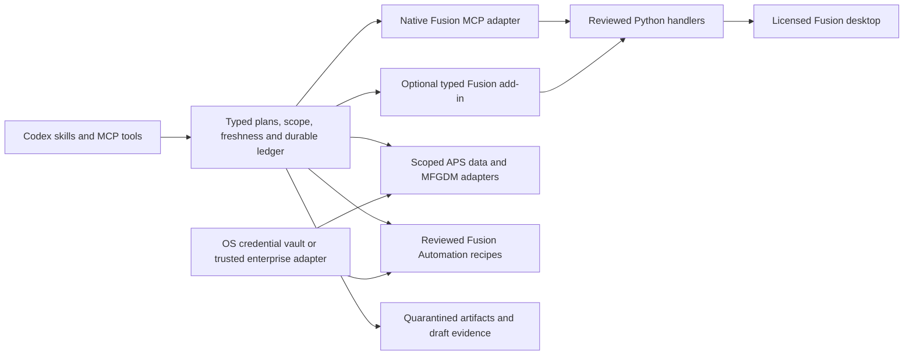

# Autodesk Fusion interoperability for Codex

This plugin gives Codex a working, typed control layer for Autodesk Fusion desktop operations, scoped Autodesk cloud data, BOM comparison, reviewed Automation recipes, and engineering handoffs. It includes two real desktop adapters: Autodesk's native MCP server and an optional Fusion add-in that dispatches the same reviewed Python handlers on Fusion's main thread.

**Release state: implementation preview, with managed writes disabled until individually qualified.** Automated protocol, governance, API-double and copied-package tests are separate from licensed Fusion kernel, Autodesk tenant, OS and manufacturing qualification. No live Fusion installation or Autodesk test credentials were available during this implementation. Do not treat a green fixture test as evidence that a part or machine program is correct.

Autodesk Fusion is also known as Fusion 360. This community project is not an Autodesk or OpenAI product and does not grant Autodesk licenses or extensions.

## What is connected



| Lane | Implemented path | Boundary |
| --- | --- | --- |
| Inspection | Explicit documents, parameters, entities, geometry, assembly context, configuration, materials, CAM and occurrence structure | Bounded observations; cloud versions, unsaved state and business revisions remain different identities |
| CAD | Parameter batches, sketches and constraints, offset construction planes, selected solid features including sweep/loft/draft/split/body mirror, occurrence placement, rigid as-built joints, configurations and materials | Exact operation variants are discoverable; no automatic conversion to direct mode or arbitrary API reflection |
| Exchange | Trusted STEP/F3D import to a new document; STEP/STL/F3D export; existing drawing PDF; flat-pattern DXF; viewport images and local renders | Explicit paths and units; geometry fidelity requires kernel/round-trip checks; a new document is not a parser sandbox |
| Manufacturing | Milling setup/operation schemas, selected strategies, pinned tool libraries/templates, toolpath futures, machining estimates, setup sheets and NC candidate posting | Entitlement and machine/post/tool qualification required; operator verification binds source state; no machine transfer/start or collision-safety claim |
| Enterprise data | APS file hierarchy/versions, MFGDM v3 fixed queries and reviewed product-owned property updates, BOM normalization/comparison/drafts, Fusion Manage reads | Explicit hub/project/model/workspace scope; no generic GraphQL, arbitrary REST URL, implicit membership changes or PLM release |
| Cloud compute | Reviewed scripts/app bundles, exact activity/input bindings, public PKCE and injected service authorization, durable submission/status/cancellation, admission accounting | Default runtime uses public PKCE; service, transfer, output-validation and billing integrations require a trusted enterprise adapter. Provider success remains `validating` until independent output checks pass |
| Outside the managed subset | Preview Electronics/drawing authoring/Animation/Simulation, unqualified feature variants, administration and physical release | Explicit capability boundaries. An assisted native-tool grant is a separate broad-authority route; it does not inherit managed guarantees |

Use `fusion_capabilities_list` with `include_schema: true` to obtain current operation contracts. The generated [operation catalog](docs/operation-catalog.json) and [support matrix](docs/support-matrix.md) are built from the same registry. Research and release gates are in the packaged [implementation plan](docs/autodesk-fusion-360-plugin-implementation-plan.md) and [validation status](docs/autodesk-fusion-implementation-status.md), copied from the repository's canonical documents at build time.

The [CAD feature guide](docs/cad-features.md) explains the six added authoring contracts, explicit path/body selection, construction-plane and axis freshness, and their required geometry checks. Their presence in the registry does not enable a previously unqualified managed profile or make them available in the synthetic bracket fixture.

## Start without Autodesk access

Install `autodesk-fusion` from this repository's Codex marketplace. It starts in **synthetic fixture mode**: no Autodesk account, Fusion process, cloud call or paid compute is used. Node.js 22.19.0 or newer is required. Built JavaScript and credential bindings are included; startup never runs `npm`, `npx` or a compiler.

This preview includes only the native credential targets listed in [native/build-manifest.json](native/build-manifest.json). Unbuilt Windows/Linux credential targets are not silently downloaded or substituted. Fixture and desktop-only use do not require the credential module; direct APS authorization requires an admitted host module or a separately qualified enterprise credential adapter. See the [validation status](docs/autodesk-fusion-implementation-status.md) before selecting a deployment platform.

Ask Codex to use `$setup-autodesk-fusion`, then `$inspect-fusion-design`. The fixture document is `fixture:bracket`; its analytic box dimensions are explicitly labeled synthetic. It exercises the control workflow, not the Autodesk geometry kernel.

For an isolated command-line diagnostic, substitute actual absolute paths:

```sh
node /absolute/plugin/scripts/fusionctl.mjs profile-init --mode fixture --output /private/new/profile-directory/fixture.json
node /absolute/plugin/scripts/fusionctl.mjs status --profile /private/new/profile-directory/fixture.json
```

The profile directory must be private. The CLI does not silently change permissions on an existing shared directory. Set the `FUSION_PROFILE` environment variable for the Codex MCP process to select a real profile. The default profile state is under the current user's `.local/state/codex-fusion`; restricted hosts can choose an approved absolute state root in their profile.

## Connect a real desktop

1. Install and sign in to an appropriately licensed supported Fusion desktop build. Finish any active Fusion command before a governed operation.
2. Create a private `managed` or `assisted` profile with `fusionctl profile-init`. It starts with writes disabled. Do not invent a passing qualification record.
3. Choose one transport explicitly. For native MCP, use `fusionctl native-discover --url http://127.0.0.1:27182/mcp`, inspect the actual Python-execution tool/schema, then `native-enroll` with its tool name, string argument and displayed SHA-256. Names are not guessed and schema drift blocks execution. Autodesk's native endpoint is unauthenticated; schema enrollment does not prove listener identity.
4. If native execution is unavailable or conflicts with workstation policy, install the assembled `dist/addin/CodexFusionInterop` directory. `fusionctl install-addin --output /absolute/new/CodexFusionInterop` copies it without overwriting an existing installation. Add and start it in Fusion's Scripts and Add-Ins dialog. Follow the [add-in guide](addin/README.md), select `desktop.provider: "addin"`, and configure its exact loopback URL and private pairing file. There is no silent fallback or automatic startup.
5. Run inspection, then the declared scenarios in the [qualification guide](docs/qualification.md) using approved synthetic documents. Scope an expiring grant to the intended operations, effects and document IDs. `allowCreatedDocuments` can extend that grant only to documents recorded as created by this exact profile/handler. Existing documents require explicit scope.
6. Enable only the operation/platform variants that the responsible engineer and administrator have qualified. Existing scoped grants avoid repeated approvals for routine work within the same authorized task.

Managed profiles require `qualifiedOperations` and `qualificationEvidence` for each enabled write. Desktop writes additionally require an unexpired `policy.desktopQualification` binding to the exact observed provider/Fusion build, broker OS/architecture/release and shipped handler/execution contract. Preparation and execution check it against fresh diagnostics; inspection remains available when it fails. The grant operates at operation-ID granularity: qualify all admitted argument variants or keep that ID disabled. This version does not enforce an argument-level qualification filter.

Assisted profiles can use reviewed typed operations without claiming managed qualification; explicitly granting `native.invoke` with `administration` additionally exposes discovered raw native tools. That broad route can execute code and cause external effects. It still rechecks its trusted profile and implementation before dispatch. A typed add-in never exposes a code evaluator, even in assisted mode.

Desktop read scope is separate from mutation scope. Omitting `policy.readDocuments` allows inspection of the signed-in user's open documents; an explicit list restricts inspection and filters document/status results. An empty list grants no existing-document reads. `policy.documents` alone limits writes, not reads. `allowCreatedDocuments` can include newly created/imported documents only with a valid successful producer receipt for this profile and implementation. Cloud hub/project/model scope is always explicit.

## Engineering workflow

Inspect the exact document and resolve entities; discover the operation schema; prepare a change; review its effects and source-state binding; execute its unchanged hash with a unique idempotency key; inspect numerical and feature-health evidence. Dependent changes are prepared after observing the previous result. Only `Design.modifyParameters` batches receive the documented local atomicity guarantee; a sequence of features, files, saves or cloud writes is not one transaction.

Prepared plans bind profile, handler/contract, source state, inputs, assets and expiry. The provider checks freshness immediately before its first API side effect. A fingerprint is not an Autodesk lock. Lost acknowledgments, partial changes and interrupted intent records are preserved; they do not trigger a second write. Use `fusion_recovery_prepare` to inspect a compensation or human recovery path. It never silently undoes user work.

Engineering material properties participate in source freshness. Assignments require the current `engineering_sha256` from `materials.list`; a same-ID library change does not preserve approval. Visual appearance and external texture contents are excluded from that engineering fingerprint, so image/render deliverables still require visual review.

Save is an explicit cloud effect. Autodesk save acknowledgement, file upload/translation completion and MFGDM index freshness are separate facts. Rendering always has an explicit local filename. Artifact roots and filenames are scoped; every generation uses a unique private directory. A completed artifact receives an immutable hash receipt only after provider completion is confirmed. Inspecting a pending file cannot finalize it. Screenshots and format signatures are supporting evidence, not geometric or manufacturing approval.

Long-running desktop work returns a durable plugin job ID bound to its session-scoped Fusion future. Use `fusion_job_status`; a Fusion restart can make that future's outcome unknown. NC output remains quarantined, with fail-on-invalid-operation and duplicate-tool checks, exact operation order and post/machine/full-tool definitions. Setup sheets and machining-time estimates do not constitute signoff.

## Cloud and enterprise deployment

Configure a public APS application's exact registered loopback PKCE callback, least-privilege scopes and allowed hub/project/model IDs. Run `fusionctl auth-login --profile /absolute/profile.json` and complete the displayed Autodesk URL in the browser. Tokens stay in the OS credential vault, with no plaintext fallback or client secret in the plugin. `auth-status` returns metadata; `auth-logout` reports provider revocation separately from verified local removal. Partial vault cleanup preserves nonsecret generation receipts so it can be retried; it does not report success when deletion or read-back fails. Each sign-in changes authorization-session binding and invalidates old prepared mutations. Credential refresh is serialized across processes.

Native Fusion Data MCP at `https://developer.api.autodesk.com/fusion/mcp` is an optional separately configured Codex service. Its MCP OAuth scopes and credentials are not direct APS grants. Its availability, hub eligibility and client OAuth support must be tested independently; this plugin does not silently add it to Codex or inherit its credentials. [Autodesk Data MCP documentation](https://help.autodesk.com/view/ADSKMCP/ENU/)

Direct MFGDM custom-property updates use fixed queries, authenticated schema gates, trusted product-owned field rules, current-state checks and read-back. They do not offer a provider atomic compare-and-set. The default requires atomic concurrency and therefore blocks those writes; a deployment must explicitly accept the documented limitation in both profile and prepared plan. Historical observations never stand in for current write preconditions. Part numbers, BOM structure, computed mass and PLM release authority are not generic property fields.

Automation recipes are privileged reviewed deployment assets, not generated scripts accepted by a model-facing tool. A generic signed activity alone does not enforce recipe/code/data authority. The [enterprise guide](docs/enterprise.md) covers scoped service adapters, output validators, cost reconciliation, immutable dependencies, network/data residency, and customer-owned schemas. An admission reservation is not a provider-enforced spend ceiling. Unknown work retains its reservation; confirmed processing still needs artifact validation and final billing evidence.

The [parameterized plate reference recipe](recipes/parameterized-plate/README.md) is shipped disabled. It creates a candidate from an exact approved source version, with bounded numeric inputs and explicit destination scope. Its activation guide requires the target engine's actual declarations, a licensed canary, output validation and cost evidence; the template is not an enabled recipe registry.

## Build and verify

```sh
npm ci --ignore-scripts
npm run verify
```

Run these from the plugin directory. The suite covers protocol negotiation, main-thread queue doubles, typed handlers, stale plans, concurrent/idempotent writes, path/JSON injection, secret isolation, OAuth failure cases, cloud accounting and copied-package startup. It does not mock a kernel and call that a live success. `npm run test:live` returns a nonzero incomplete result without an eligible real profile and scenario. Follow [qualification](docs/qualification.md) for meaningful real scenarios and the explicit Windows/macOS/CAM/account gates.

The [workflow evaluation corpus](docs/workflow-evaluation.md) contains 66 supported and 66 adversarial/ambiguous cases with paraphrases and held-out splits, including twelve additional manual CAD feature cases. `npm run evaluate:workflows` validates it without starting a model; an explicit run uses isolated synthetic profiles and leaves live engineering and independent rubric review incomplete. The [local performance harness](docs/performance.md) separately measures schema/policy, ledger, bounded fixture inspection, a 100-operation batch and optional resource observation. Neither harness promotes a live profile or qualifies a release.

Builds pin the npm lockfile, bundle JavaScript, emit TypeScript declarations, copy the single canonical Python handler into the add-in, and generate source/runtime hashes, catalog, notices and a software inventory. Native credential modules are built separately from the included community-patched Rust source, exact Cargo lockfile and Rust 1.98.0. Original npm platform binaries are not redistributed. Normal package builds verify each admitted binary against its source/build receipt and collected dependency notices; they do not run a compiler or download native modules. The [native build guide](docs/native-builds.md) explains target admission, provenance limits and the conservative dependency inventory. Different OS SDKs can produce different native bytes.

The public lockfile records canonical npm tarball identities and exact integrity hashes, without a developer's private mirror address. npm's default registry replacement uses the deployment's configured registry; organizations retain control of their registry, proxy and access policy. This plugin does not change those settings or bypass a failed policy check. See the [npm lockfile contract](https://docs.npmjs.com/files/package-lock.json/) and [registry configuration](https://docs.npmjs.com/using-npm/config/#replace-registry-host).

Set `FUSION_TEST_OS_VAULT=1` when running `npm run test:vault` to opt into a real OS credential-service round trip with unique synthetic entries and verified cleanup; without that flag it explicitly skips. A module-load smoke test alone does not prove access to an installed credential service.

## Operations and security

See [security boundaries](SECURITY.md) and [operations](docs/operations.md). Keep profiles, credentials, CAD files, customer endpoints and live test evidence out of this public repository. Use synthetic examples only. Deleting an execution lock is a recovery operation, not proof that an interrupted CAD edit or cloud job did not happen. A kill switch blocks new execution and cannot reverse previously committed effects or stop a provider job without cancellation support.

Guarantees apply to calls through this facade. Same-user shell tools, other native MCP clients, other add-ins, writable configuration and physical machine actions are outside its process boundary. Strong enterprise enforcement requires host/client/network controls and a separately managed trusted deployment. No AST filter, localhost URL, HMAC pairing file or plugin skill is an operating-system sandbox.
